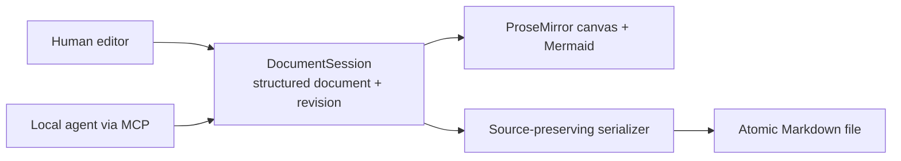
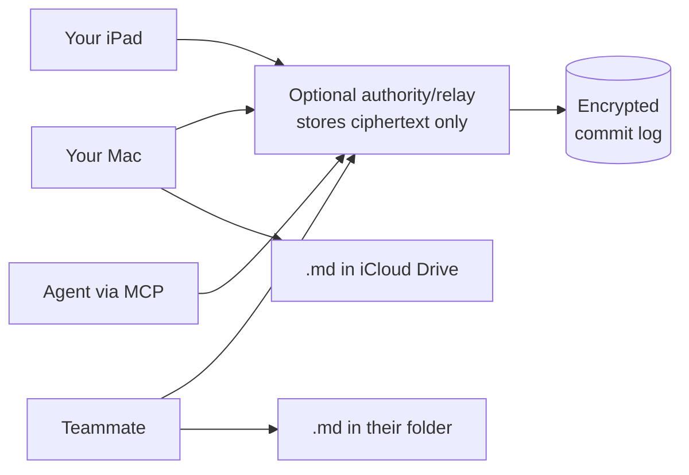

# SimpleMark — Live Collaboration

**Prepared expansion architecture, not the install reason or the next product proof.**

- **Status:** Draft 5 — retained for later agent participation and distributed collaboration;
  renderer-first POC governed by [`ADR-0005`](decisions/0005-rendered-document-before-agent-participation.md),
  decomposed by [`ADR-0007`](decisions/0007-annotation-before-participation.md)
- **Date:** 2026-08-07
- **Companion to:** [`DESIGN.md`](DESIGN.md), `AGENT-WORKSPACE.md`, [`RENDERERS.md`](RENDERERS.md)

---

## 1. Where collaboration sits

[`PRODUCT.md`](PRODUCT.md) owns the current product contract. **SimpleMark is not an AI workspace.**
It is the beautiful living document for AI work. The primary workflow is an external agent writing
the local file while the human reads, judges, and occasionally corrects the rendered result.

```text
First:   open, render, watch, read, judge, correct
Later:   invite an agent or human only if the file-based living document is insufficient
```

You never enter a separate workspace product. Collaboration, if earned, should feel like asking
someone into the document—not like the app asking permission to manage the work.

> **The product statement:** Your agent writes the Markdown. SimpleMark turns it into a beautiful,
> living document. Collaboration is an optional capability behind that experience.

Where that puts us against the category:

| Their centre of gravity | SimpleMark's |
|---|---|
| AI / team workspace | One rendered document |
| Cloud collaboration | Local files first |
| Agents as the product | Rendering and document feel as the product |
| Organisational knowledge | One exceptional note, opened instantly |
| Ongoing agent workflows | External file updates first; direct participation only if earned |

### 1.0 What this section specifies

Everything below describes a **later session capability.** None of it belongs in the renderer-first
POC or default interface: no participant controls, coordinator, relay, chat, presence, scope, run
state, or activity surface. The ordinary product is the same local file rendered beautifully while
external tools update it.

**One exception, and it is a narrow one.** §4's Conversation layer ships its human half — a note
anchored to a passage, and resolving it — ahead of everything else here, because it introduces none
of the nouns in that list. No participant, no authority, no agent, no run state. Its only surface is
a rail that does not exist when nothing is unresolved.
[`ADR-0007`](decisions/0007-annotation-before-participation.md) records why that is a release from
the `ADR-0005` gate rather than a hole in it: the gate governs putting an agent inside a human's
attention, and a person annotating their own document is not that.

The useful idea borrowed from Google Wave is the living shared artifact. Not the inbox, the chat, the tasks, or the social layer.

> **The first optional agent session:** one human and one local agent share an application `DocumentSession`.
> **The later room:** N humans and N agents may share an authority-backed document only after the
> authority-decision gates in §8 pass. Both land as ordinary Markdown you own.

```text
Document:
  "We should use Yjs for live coordination."

You:
  highlight the sentence → "Why not Automerge?"

Agent (Architecture):
  starts a reply, researches, begins inserting a comparison table

You:
  interrupt → "Stop. Optimise for local-first and iPad."

Agent (Architecture):
  receives the interrupt mid-work, abandons the draft,
  revises the table and states the new tradeoff
```

Every participant — human or agent — has identity, cursor, selection, presence, a live inbox for redirects and stops, a visible scope, and transactions that can be reviewed and reverted. **There is no second class of participant.** A human may rewrite an agent's paragraph; an agent may improve a human's diagram; an agent may critique and edit another agent's table. The room does not care which kind of thing you are.

That eventual symmetry is the point. The POC first tests whether one scoped agent is useful.

### 1.1 The design rule that keeps it from becoming Slack

> **Chat is ephemeral coordination. The document is the durable result.**

Conversations exist to steer work and resolve decisions. Once resolved, the conclusion belongs in the document and the thread collapses. A note that accumulates a thousand un-resolved comment threads has failed.

One passage-anchored conversation serves humans and agents, but it has two explicit modes:

- **Live** is immediate coordination. When addressed to a running agent as a redirect, sending it
  stops and replaces that run.
- **Leave note** is asynchronous communication. It persists for a participant to answer later and
  changes no one's authority or execution state.

The distinction is visible at the composer. A chat message that says “stop” is still only a
message; the **Stop** control is what fences an agent generation. Humans can be asked, replied to,
or handed work, but are not mechanically “redirected.”

---

## 2. The architecture correction

[`ADR-0002`](decisions/0002-local-document-session-before-crdt.md) removes Yjs from the first
direct-participation test. [`ADR-0005`](decisions/0005-rendered-document-before-agent-participation.md)
moves that test after the renderer-first product proof. When direct participation is tested, one
process already provides ordering and authority, so the editor and local MCP adapter share one
application `DocumentSession`. Distributed merge is introduced only when a second client exists.



### 2.0 Research that changed the plan

- [Peritext](https://www.inkandswitch.com/peritext/) shows why Markdown delimiter characters are
  the wrong unit for rich-text collaboration: a text CRDT can merge to valid Markdown while losing
  both authors' formatting intent. Any later CRDT stores a structured document, never Markdown
  source punctuation.
- [ProseMirror's collaboration design](https://marijnhaverbeke.nl/blog/collaborative-editing.html)
  shows the simpler centralized alternative: one authority orders changes and clients rebase
  transactions. The local POC is simpler still because every participant is in one process.
- [Pitter Patter Collab](https://pitter-patter.dev/docs/collab/overview/) packages that model around
  `prosemirror-collab-commit`: native ProseMirror steps remain inspectable and are rebased at the
  authority. This is now the first candidate for the multi-client spike.
- The [Pitter Patter announcement](https://discuss.prosemirror.net/t/a-new-rich-text-framework-built-with-prosemirror/9036)
  also exposed an unfinished contention-retry path. The project is new and must be spiked at pinned
  versions; it is not yet an assumed production dependency.
- Yjs integration changes the practical ownership of positions, undo, decorations, persistence,
  and document history. Its [relative positions](https://github.com/yjs/yjs),
  [UndoManager](https://docs.yjs.dev/api/undo-manager), and
  [IndexedDB provider](https://docs.yjs.dev/ecosystem/database-provider/y-indexeddb) are explicit
  mechanisms to evaluate, not invisible library details.
- Reports about `y-prosemirror` incompatibilities identify important tests, but are version-sensitive.
  The later spike pins exact versions and judges observed behavior rather than repeating blanket
  claims from older issues.

## 2.1 What changes—and only while live

Two decisions gain an exception. Neither is replaced, and neither applies to a note with no session attached.

| Decision | Was | Now |
|---|---|---|
| **D1** Files are the truth | Files are the only truth | Unchanged when cold. **During the POC session**, the local `DocumentSession` coordinates and the file is the durable projection. A future multi-client authority may take that role only after the spike. |
| **D2** Sync delegated to the cloud drive | iCloud propagates everything | Unchanged when cold. The POC is in-process; peer transport and save leadership are later decisions. |
| **D7** Fidelity contract | Untouched blocks re-emit verbatim | **Unchanged.** Original source is an immutable save baseline, never collaboratively edited text. |

### 2.2 D8 — Collaboration is a capability, not the storage model

Five statements, in order of importance:

1. A note **opens locally and works perfectly alone.** No service starts.
2. **Invite agent** starts a local `DocumentSession` for *that note* when needed.
3. The agent receives only the explicit scope and capabilities the human grants.
4. On close, the durable Markdown saves to your folder as usual.
5. **No active session means no collaboration service, no cost, no overhead.**

Within a live session, the ownership rule below holds.

**Ownership rule, stated once and obeyed everywhere:**

| Document state | Coordination truth | On external file change |
|---|---|---|
| **Live POC** (a session is attached) | The local `DocumentSession` | Import as a **named external transaction**, visible in Activity, revertible |
| **Cold** (no session) | The file | Load on open; nothing to reconcile |

A live document is **never** blindly replaced by a file read. If the session has unsaved local edits and the file changed underneath, the user sees a choice — the same diff UI `DESIGN.md` §8 already specifies, now with a third option: *merge the external change as a transaction*.

### 2.3 What honestly gets weaker later

Say it out loud rather than discovering it later:

- A future multi-client system has **two truths** that can drift: CRDT state and the Markdown
  projection. Persistence and recovery must be proven before that system ships.
- **The folder is no longer sufficient on its own** while a session is live. It is still sufficient the moment the session ends, which is the property that matters for lock-in.
- **iCloud is now the wrong path for real-time.** It was never going to work for that anyway; this makes the split explicit instead of implicit.
- A future remote room may require a relay. Its existence, encryption, and operation are separate
  product decisions, not POC commitments.

---

## 3. Future scope: multi-human and multi-device

Real multiplayer is the expansion path after both the renderer-first POC and an optional local
agent-participation test, not the first executable target. `POC.md` proves the living local document
without an in-app agent. Only later evidence may justify a local participant, remote humans, a
second device, a relay, encryption, or multi-agent governance.

| After the POC | Deferred further |
|---|---|
| Multiple humans in one document, live | Public/anonymous sessions |
| Multiple devices per human (Mac, iPad) | Org accounts, SSO, billing |
| N agents as participants, editing each other | Federated agent identity |
| Presence, cursors, selections, attribution | Fine-grained per-block ACLs |
| Interruption and steering | Comment-only guest links |
| Per-participant undo, transaction revert | Server-side conflict analytics |
| Region leases, loop breaker, scoped agent roles | Agent-to-agent negotiation protocols |

This costs four subsystems the single-machine version avoided. They are intentionally absent from
the POC and should be implemented only after its day-of-use result is positive. Sections 3.1–3.4
are a **candidate architecture, not accepted scope**; ADR-0002's authority-decision gate owns the
choice between ProseMirror step authority, Yjs, or no multiplayer expansion.

### 3.0 Web and native are equal clients

SimpleMark is one product with a web shell and a native shell. Neither is a preview of the other,
and neither gets a separate document model. When a note is live, both connect as participants to
the same `DocumentAuthorityPort`, alongside invited MCP agents. The authority orders/rebases
transactions and designates exactly one save leader to materialize the portable Markdown file.

This makes a web-to-native handoff ordinary collaboration rather than import/export: open the same
note in either shell and receive the same document version, presence, scopes, fences, activity, and
control state. Browser persistence and native filesystem access are adapters, not competing
sources of truth.

Switchboard may host the surrounding Deliverable Review Room or join as an authenticated
participant, but it is not the document authority, save leader, or agent-control authority. A Room
may link to a SimpleMark note and pin an exported revision/evidence snapshot for acceptance review.

### 3.1 Transport: local first, relay only if you need one

**Cheap for personal use is a requirement, not an aspiration.** The app bundles the collaboration service; you plus your local agents never leave the machine.

| Case | Transport | Cost |
|---|---|---|
| You + local agents | In-process, localhost | Zero. No network. |
| You + someone on your LAN | mDNS discovery, direct peer connection | Zero |
| You + a remote human, or your iPad | An always-on peer, or a tiny relay | Near-zero; **optional** |

A relay is what makes cross-device real-time work when no device of yours is awake. It is a convenience at the edge of the product, **not its foundation** — deliberately the least trusted component in the system.



**Encryption is a later requirement, not a selected protocol.** If a remote authority/relay stores
content or commits, the threat model must decide what it can validate while content remains opaque.
Schema, permissions, agent scopes, and generation fences are easiest when a trusted authority can
inspect native ProseMirror steps; zero-knowledge transport may require client-side validation or a
different trust boundary.

- **First protocol candidate:** Pitter Patter Collab / `prosemirror-collab-commit`, with the Mac or
  optional service acting as authority. Yjs/Hocuspocus is the comparison only for masterless use.
- **Self-hostable and optional.** The app remains fully functional without a remote service.
- **LAN fast path:** peers on the same network discover each other via mDNS and sync directly, using the relay only for presence. Two people at one table do not round-trip through the internet.
- **Offline hypothesis:** clients retain pending steps and reconnect/rebase through the authority.
  The spike must test long disconnection, contention retry, authority restart, and when a conflict
  still needs human review.

### 3.2 Identity: keys, not accounts

No sign-up, no password, no email. Each participant generates a keypair on first run.

| Concept | Mechanism |
|---|---|
| **Who you are** | An Ed25519 keypair in the OS keychain, plus a display name and colour |
| **Your other devices** | Paired by QR code or a 6-word phrase; a device joins your identity, it does not become a new person |
| **Inviting a human** | A share link carrying the document key and a capability. Anyone with the link can join — treat it like a Google Docs link |
| **Inviting an agent** | The MCP server is handed a scoped capability by you; agents never self-enrol |
| **Revocation** | Rotate the document key and re-issue links. Revoked peers can no longer decrypt new updates |

This gets real multi-human collaboration without building an account system, and it means the project can never leak a user database it doesn't have.

### 3.3 Permissions: capabilities the relay can check

Because content is encrypted, the relay cannot enforce rules about *what* you write — but it can enforce *whether* you may write at all, because every update is signed.

| Capability | Can |
|---|---|
| `owner` | Everything, plus rotate keys and revoke peers |
| `editor` | Read, write, comment, run agents |
| `commenter` | Read, add Conversation-layer threads; document writes rejected |
| `reader` | Read only; presence visible |

The relay verifies the signature and the capability grant on every update and rejects unauthorized writes at the door. Clients enforce the same rules locally, so a malicious client cannot corrupt a document even if it bypasses the relay.

**Agents get their own capability, always narrower than the human who invited them,** and it is visible in the participant list. An agent invited by a `commenter` cannot write to the document.

### 3.4 The save-leader problem — the trap

**This is the failure mode that would otherwise appear in month three.**

Every client holds the same document, and every client wants to write `note.md` into its own synced folder. On one machine that is fine. With three humans and two devices, five clients writing the same logical note into five folders — and iCloud propagating between two of yours — produces a steady stream of `(conflicted copy)` files, all containing *identical* content. The collaboration works perfectly and the filesystem looks broken.

**Rule: exactly one client per storage location is the save leader.**

The unit is **where the bytes end up, not which machine holds the folder.** This distinction is
load-bearing. `~/Dropbox/notes` on your Mac and `C:\Users\you\Dropbox\notes` on your PC are two
devices and **one destination** — Dropbox propagates between them. Treating them as two elects two
leaders, both write byte-identical content to the same synced path, and the provider manufactures
conflicted copies of a document nobody edited twice. That is the exact failure this section exists
to prevent, arriving through the back door.

**[`ADR-0006`](decisions/0006-one-authoritative-change-stream.md) names that unit and fixes how it
is identified.** An earlier draft of this section said the unit was identified by its
provider-synced root. That was the right instinct and an unimplementable rule: paths differ across
devices, provider topology is not generally observable, and inferring it would require
provider-specific code in a product that deliberately operates no cloud sync service.

So the unit is a **materialization group** with a stable opaque id, and the id is **explicitly
paired or carried in SimpleMark-owned portable metadata — never inferred** from `~/Dropbox`, an
iCloud container, a provider API, machine identity, or path spelling. Clients that cannot prove they
share a group are different groups. Failing closed this way is deliberate: an unpaired second device
keeps its own copy, which is untidy, where a wrongly merged group produces exactly the conflicted
copies above.

- Each materialization group elects a leader among the clients attached to it — normally the only one.
- The leader alone performs the debounced Markdown write. Others render, edit, and synchronize
  through the chosen authority protocol but never touch that folder.
- Leadership uses an explicit renewable lease owned by the authority. A CRDT-awareness lease is
  only a candidate if Yjs wins the spike; timeout values must be measured rather than assumed.
- Your teammate's Mac is a *different* group and has its own leader. Everyone ends up with their own portable copy, written once each.
- Cloud providers replicate the leader's bytes. They do not order transactions, elect the leader, or
  become the document authority.

A materialization group is **not** a *vault*. A vault is the folder tree an agent is confined to
([`MCP-SERVER.md`](MCP-SERVER.md) §11) and the unit `agentMayOpenNotes` is set on. One is about
where bytes land, the other about what an agent may reach; an earlier draft used one word for both.

Without this rule, multi-device and files-on-disk actively fight. With it, they compose.

---

## 4. The three layers of a document

| Layer | Contains | Persisted as |
|---|---|---|
| **Canvas** | The polished Markdown document and rendered blocks | The `.md` file |
| **Conversation** | Live chat and asynchronous notes anchored to a range, block, or diagram node; agent control events may be shown here but are issued separately | `<app data>/SimpleMark/threads/<noteKey>.json` |
| **Activity** | Who changed what, agent status, reversible transactions, snapshots | `<app data>/SimpleMark/activity/<noteKey>.jsonl` |

Only the Canvas is portable Markdown. Conversation and Activity are sidecars — losing them loses history and discussion, never content. That asymmetry is deliberate: **the thing you own must survive the thing you don't need.**

> **Amended by [`ADR-0007`](decisions/0007-annotation-before-participation.md).** Earlier drafts put
> both sidecars in `.simplemark/` beside the document. Opening one file from a folder the app does
> not own would have created a directory there, so they live in application data instead, keyed by
> the note's front-matter `id` — or by a hash of its path when the document would not take one. The
> app is a guest in folders it does not own. The accepted cost: copying the `.md` elsewhere does not
> carry its threads.

Conversation ships before any of §5. Its human half — anchor a note to a passage, list it, resolve
it — needs no participant, no authority and no agent, and `ADR-0007` releases it from the
`ADR-0005` gate on that basis. **Leave note** in §5.4 is that same surface once an agent is in the
room; nothing about it changes when one arrives.

### 4.1 Anchors

Two mechanisms, because there are two different questions. They are not competing sources of truth.

| Job | Mechanism | Owner |
|---|---|---|
| A human's note, across sessions and external edits | Quote + 30 characters of context either side | Pure domain matcher |
| A participant's scope and edit target, within a session | Opaque, authority-issued token | The document authority |

A note anchor must be re-derivable **from text alone**, because after the app closes the text is all
that survives. A participant anchor must be **opaque**, because
[`ADR-0004`](decisions/0004-mcp-as-participant-client.md) §6 makes one-scope-at-a-time structural
rather than advisory — an agent that could mint an anchor could mint a scope. If a later Yjs adapter
is accepted, it may implement the participant contract with `RelativePosition`; the note contract is
unaffected either way, which is part of why they are separate.

**Neither guesses.** Ambiguity resolves to a visible orphan, never to a near match: a note on the
wrong sentence is worse than a note that admits it is lost. While a document is open, positions map
forward through every transaction and the note anchor is re-derived on close, so editing in
SimpleMark teaches an anchor its new wording instead of staling it.

Both replace the content-hash anchors in `AGENT-WORKSPACE.md` §3.1, which that
document already records as superseded.

---

## 5. Agents as participants

### 5.1 Identity and presence

An agent gets what a person gets: a name, a colour, a cursor, a selection, and a status. `Codex is drafting a diagram…` appears in the presence bar exactly as a human's typing indicator would.

### 5.2 Two modes

| Mode | Behavior | Default |
|---|---|---|
| **Collaborate** | Edits the live document directly, with its own cursor and attributed transactions | Yes, for personal use |
| **Suggest** | Streams proposed edits as tracked suggestions you accept or reject | For unattended or unfamiliar agents |

A single **Pause agent edits** button freezes all agent writes without disconnecting them. Non-negotiable — sometimes you need to write without something else moving the page.

### 5.3 Transactions, not keystrokes

An agent edit is grouped and named: *"Added architecture section"* — not 70 individual operations. This matters in three places at once: the Activity timeline is readable, revert works at a meaningful granularity, and your `Cmd+Z` is not endangered.

Agents stream by **coherent unit** — a heading, then a paragraph, then a diagram — never character by character. Character-level AI typing is a novelty for ten seconds and an irritation forever.

### 5.4 Interruption is out-of-band

**The correction that makes steering actually work:** an interrupt must not travel through document operations. A busy agent writing a table will not notice a new comment until it finishes the table — which is exactly the moment you were trying to prevent.

So there is a separate control channel:

```ts
interface AgentControl {
  status: 'idle' | 'thinking' | 'writing' | 'paused'
  inbox: ControlMessage[]        // polled between every step
}

type ControlMessage =
  | { t: 'stop';     reason?: string }
  | { t: 'redirect'; instruction: string; anchor?: RelativePosition }
  | { t: 'pause' } | { t: 'resume' }
  | { t: 'scope';    ranges: RelativePosition[] }   // "only work in this section"
```

**Contract:** an agent must drain its inbox between every step of a multi-step edit, and must abandon in-flight work on `stop`. An agent that ignores its inbox is disconnected by the host after one warning. This is enforced, not requested.

#### The redirect interaction

Choosing **Redirect** beside an active agent passage opens that passage's conversation instead of a
global chatbot. The current exchange remains visible, with two composer modes:

| Composer mode | Send does | Control effect |
|---|---|---|
| **Redirect now** | Adds the instruction to the thread, fences the current generation, and starts a replacement run in the same visible scope | Yes |
| **Leave note** | Adds an anchored note for a human or agent to answer later | None |

The UI may present the control event in the thread so the sequence is understandable, but the
thread is not the transport or authority. `redirect` still travels through `AgentControl`, bumps the
generation, and refuses late edits. A human recipient sees the same conversation and can reply live
or later; the app does not pretend it can abort a person.

### 5.7 Governing the room — focus-aware, and small

Evidence first. The CHI 2026 study *Collaborative Document Editing with Multiple Users and AI Agents* (30 people, 14 teams) found:

- Teams **liked** AI inside the shared document rather than in a side chatbot. Validates the artifact.
- Participants used agents as **tools within existing writing norms**, not as social teammates.
- **Autonomous, document-wide intervention produced cognitive and visual overload.** Participants preferred manual, scoped invocation.
- **~23% did not feel in control of the text.**
- The study deliberately had agents reply *as comments* rather than edit directly, to preserve human control.

Its design direction is not "always require approval." It is sharper than that:

> **Agent initiative should be aware of human focus, collaboration activity, and attention.**

That is a stronger constraint than leases and budgets, and it partly replaces them. An earlier draft of this section specified region leases, a reaction budget, a loop breaker, and multi-agent deconfliction — a governance protocol for a problem not yet observed. **Cut to the smallest thing that respects focus.**

#### v1 room defaults

```text
- Humans edit anywhere, always. No lease, no wait, no permission.
- An agent has ONE assigned selection or section at a time.
- An agent never edits text under an active human cursor.
- An agent streams its intent, then ONE coherent edit transaction.
- Any human can interrupt, redirect, or revoke its scope at any moment.
- Background or document-wide work produces a quiet review item,
  never an unsolicited inline edit.
- Each agent has a small per-minute change budget.
```

Explicitly **not** in v1: multi-agent debate loops, an elaborate lease protocol, autonomous document-wide rewriting, agent-to-agent reaction budgets. Those solve problems the study suggests you should design out rather than manage.

#### Focus-awareness, concretely

| Situation | Agent behavior |
|---|---|
| You are actively editing a paragraph | Does not enter it. Waits or works in its own scope. |
| You select a section and invoke an agent | May edit within that scope, live |
| Two humans active in a section | Offers a compact suggestion, or works elsewhere |
| Nothing selected, no invocation | Does nothing. There is no ambient agent activity. |
| Document-wide work requested | Deferred, quiet, surfaced as a review queue |

**Invocation is manual.** An agent in the room is not a process looking for work; it is something you point at a thing.

> **Clarified by [`MCP-SERVER.md`](MCP-SERVER.md) §10.2, not repealed.** This rule governs acting
> **inside a human's attention**, which is what the CHI evidence above is about. It never governed
> whether a document may exist. An agent asked to edit or create a note nobody has open may start an
> authority for it — that starts a document, never a window: nothing appears, nothing scrolls,
> nothing takes focus. Every constraint in this section applies unchanged the moment a human is
> present. Opening is gated per vault by `agentMayOpenNotes: ask | allow | deny`, default `ask`.

#### Interruption is enforced by the fence

A stop is not a message. Every agent operation carries a run id and a generation; interrupting or redirecting bumps the generation, and an edit arriving from a superseded generation is **refused, not merged**. See `SWITCHBOARD-KERNEL.md` §2 — this is the one piece of machinery worth building before the first agent edit lands.

Humans never need a lease to type. In the POC there is only one human; in a later room, the chosen
collaboration algorithm handles concurrent humans. Fences and scopes constrain only an agent's
right to commit an automated transaction.

#### Attribution with mixed authorship

A block edited by several participants shows each in its margin chip, most recent first; Activity holds the full chain. Provenance is never collapsed to "last writer" — where an agent may polish a human's prose, *who wrote this* genuinely has several answers.

#### This is a hypothesis, not an advantage

Syncpen ships propose-only: agents suggest, humans accept. The CHI study's participants preferred scoped, manual invocation and 23% felt out of control. **Both point away from live agent editing.**

The bet is that *scoped, focus-aware, interruptible* live editing is better than propose-only — faster, and it keeps the agent's work anchored where it belongs. That is worth testing and is not yet demonstrated. §8.2 is the test.

### 5.5 Delegation in the document

The interaction that ties it together:

```text
[select a paragraph, a diagram, or a range]
  → Ask agent
      → Improve this
      → Find evidence
      → Turn this into a chart
      → Challenge this assumption
      → Implement this elsewhere
```

The agent receives exactly that scope as context, writes its work into that location, and stays interruptible. **The causal chain from prompt → reasoning → source → artifact is never lost**, because the request is a Conversation-layer thread anchored to the same position the resulting edit lands in.

---

## 6. Mechanics

### 6.1 Undo

`Cmd+Z` undoes **your** last action. Never an agent's, never another participant's.

In the POC, the editor owns the human undo stack and `DocumentSession` journals named agent
transactions for deliberate revert from Activity. A later Yjs adapter must prove equivalent
separation with tracked origins; it cannot redefine the POC contract.

### 6.2 Save

```text
editor or agent transaction → DocumentSession → structured document
                            → debounce/on blur → serialize → atomicWrite
```

The POC has one process and one file projection. Crash recovery may journal named transactions, but
there is no Yjs update log. A later multi-client design must specify durable update persistence and
checkpoint/compaction before claiming crash-safe offline collaboration.

### 6.3 Fidelity survives — D7 stands

The claim that byte-identical preservation must soften is **not** the tradeoff being made here. Each
block begins a save epoch with:

```ts
interface BlockState {
  content: ProseMirrorNode    // the current structured representation
  sourceRevision: string      // checkpoint that established this baseline
  originalSource: string      // immutable exact bytes loaded/checkpointed
  dirty: boolean              // monotonic until successful save
}
```

On save, clean blocks emit `originalSource` verbatim. Once dirty, a block ignores that baseline and
serializes the current structured node. Only a successful atomic save creates the next baseline.
`originalSource` is neither CRDT content nor a last-writer-wins register. The ten acceptance
fixtures apply unchanged, and the Phase 0 spike is still the gate.

What actually softens is the *ownership* claim, not the *fidelity* claim: while a document is live, the file is a projection rather than the master. §2.1 states it precisely.

### 6.4 UX requirements — these are the product, not polish

- Your cursor neutral; each agent named and distinctly coloured.
- Live selection shown for every participant.
- Compact status line: `Codex is drafting a diagram…`
- Local changes animate; remote changes appear by coherent unit.
- **Never steal the viewport.** "Follow agent" is opt-in and scrolls to its selection; an agent working elsewhere does not move your page.
- Attribution visible in the document margin and in the timeline.
- Timeline lets you inspect, jump to, or revert any transaction.

---

## 7. MCP, revised for live documents

> **Superseded by [`MCP-SERVER.md`](MCP-SERVER.md) and
> [`ADR-0004`](decisions/0004-mcp-as-participant-client.md).** The two-surface split and the
> `note_is_live` routing rule below are retired. An agent should be able to work in notes nobody has
> open — that requirement stands — but it is met by **one** surface serving every note rather than by
> routing between two. The instinct in this section that survives verbatim is the last one: an agent
> names a kind from the renderer catalog rather than sending text that happens to sniff correctly.
>
> Retained for the reasoning; read the contract in [`MCP-SERVER.md`](MCP-SERVER.md).

`AGENT-WORKSPACE.md`'s tool surface was designed for cold files. It stays — an agent should be able to work in notes nobody has open — and gains a live surface alongside it.

| Cold file (existing) | Live session (new) |
|---|---|
| `read_note` → `{content, rev}` | `open_live_note(path)` → `{docId, content, participants}` |
| `patch_note(id, expected_rev, edits)` | `apply_transaction(docId, name, ops[])` |
| anchors by content hash | session-local block/range anchors |
| — | `subscribe(docId)` → change + presence stream |
| — | `set_presence(docId, cursor, selection, status)` |
| — | `insert_at_anchor(docId, anchor, markdown)` |
| — | `apply_structured_block(docId, anchor, kind, source)` |
| — | `poll_control(docId)` → `ControlMessage[]` |

All live commands delegate to `DocumentSession`. If a later Yjs adapter is accepted, it may encode
those anchors as relative positions behind this application contract; MCP does not learn Yjs.

**Routing rule:** if a session exists for the note, live tools apply and cold writes are refused with `{ error: 'note_is_live', docId }`. If not, cold tools apply. One rule, no ambiguity, no split brain.

`apply_structured_block` is how an agent adds a Mermaid diagram or a Vega-Lite chart — it names a kind from the renderer catalog and supplies source, so the block arrives already correct rather than as text that happens to sniff correctly.

---

## 8. Revised build sequence

The gate moved. It is no longer "the file watcher caught an agent write."

**The notebook ships before the room.** Collaboration is built on a foundation that already works alone — which is also the honest test of whether it is a capability or a dependency.

| Phase | Deliverable | Proof |
|---|---|---|
| **0** | **Fidelity spike** (`DESIGN.md` §12) | The 10 fixtures survive parse → serialize untouched |
| **1** | **Beautiful living document POC** | Open → render → watched external update → correct → save → reopen; `POC.md` passes and is used for one real day |
| **2** | **Daily-use renderer product** | Technical renderer breadth, calm file handling, typography; shippable alone |
| **A** | **Anchored notes** | Capture on a passage, survive reopening, orphan visibly rather than guess. No agent, no authority |
| **B** | **Resolve** | A thread closes and writes nothing to the document |
| — | **The reader one-day trial** (`POC.md`) | **The gate.** Only a correction or direction workflow that external file updates cannot serve opens what follows |
| **C0** | **AI connection** | An unresolved design problem: provider, model and key without a cockpit |
| **C** | **Ask** | An agent answers in a thread and cannot edit the document |
| **D** | **Agent edits from a thread** | One `DocumentSession`; prove direct transactions beat the watched-file workflow without adding cockpit UI |
| **4** | **Multi-client authority decision** | Only if needed: step authority first; compare Yjs only for masterless need |
| **5+** | **Collaboration expansion** | A second human client, then remote peers, Activity, and multi-agent tests |
| **Later** | Excalidraw, converters, public plugin API | Only after the document experience remains coherent |

**Phase 2 is a real ship.** If everything after it were abandoned, SimpleMark would still be the
beautiful living document for AI-generated Markdown. Broader formats and participation expand only
after their value is proven.

**A and B sit before the gate; C0, C and D sit behind it.** That split is
[`ADR-0007`](decisions/0007-annotation-before-participation.md): what Phase 3 used to call *optional
local agent participation* was one row containing an unresolved provider problem, a conversation
surface, an authority, a fence and separate undo. Anchoring a human's own note to a passage adds no
participant and is not what `ADR-0005`'s gate was protecting, so it ships on its own — and whether
it proves useful alone is the honest test of whether the Conversation layer is a capability or a
dependency.

**The gate row is not decoration.** `POC.md`'s reader trial is the evidence that authorizes C0
onward, and it is a different trial from §8.1's — six questions about reading, not four about an
agent. Running §8.1 without it means testing whether an agent in the document is good before
establishing that anything needed one.

### 8.1 The D trial — local agent participation

This is explicitly **not** the renderer-first `POC.md` trial, and it is not a substitute for it.
`POC.md`'s trial asks whether the reader is worth keeping open and whether anything needs an agent
in the document at all; this one asks whether a scoped agent editing live is better than reviewing
its suggestions. Run this only after that one has authorized C0, and after A and B have shipped —
this trial needs a thread to speak into.

```text
- One human cursor in one local Markdown document.
- One visible agent scope and status; a decorative cursor is optional.
- Human selects a section: "turn this into a Mermaid diagram."
- Agent works in that scope and inserts the block live.
- Human interrupts midway: "make it simpler."
- Agent revises in place; the superseded run cannot land a late edit.
- Human `Cmd+Z` leaves the agent transaction intact; Activity reverts it deliberately.
- The document saves as normal Markdown.
```

**Then use it for a full day on real work.** Track four things and nothing else:

1. How often you interrupt or revoke the agent's scope.
2. Whether you hide its presence or activity.
3. Whether agent edits feel faster than reviewing suggestions.
4. Whether you trust the saved Markdown afterwards.

**If it feels like a useful co-worker, keep live-edit mode.** If you repeatedly pause it, make suggest mode the default and keep live mode for the moments where it is magical. Either outcome is a result; only building both without measuring is a failure.

### 8.2 Three definitions of done

**Phase 2 — the notebook:**

> You paste a bare Mermaid diagram into a note and it becomes a picture. Typography is beautiful,
> search is instant, and the file on disk is clean Markdown that opens correctly in Bear. Nothing
> is running but the app. PPTX and other document previews arrive only after their converter is
> separately proven.

**A and B — the annotated document:**

> On a call, you highlight a sentence, press one key, type the customer's question, and keep
> reading. Reopening the note a week later puts the note back on that sentence. A passage someone
> rewrote elsewhere leaves its note in the rail saying what it was on, rather than sliding onto the
> paragraph below. Resolving one closes it and changes nothing in the `.md`. With nothing
> outstanding, the window looks exactly as it did before the feature existed.

**Phase 5+ — the room expansion:**

> You and a colleague are typing in one document. Codex adds a diagram inside the section you
> selected; its cursor and transaction are visible. You interrupt it mid-table and its old
> generation cannot land. `Cmd+Z` undoes your sentence and nobody else's. Agents only act when
> manually invoked, stay out of active human cursors, and surface document-wide work as review.
> Remote peers and iPad support arrive only after this local room is proven.

---

## 9. Open questions

1. **Does the one-day trial justify a second client at all?** If suggest-first wins, distributed live
   editing may not be the next investment.
2. **Step authority or masterless CRDT?** Pitter Patter / `prosemirror-collab-commit` is the first
   candidate. Yjs needs a demonstrated masterless requirement, not merely intermittent connectivity.
3. **Structured CRDT mapping.** If Yjs still wins, prove the exact `y-prosemirror` mapping rather
   than storing Markdown or separately merging `originalSource` metadata.
4. **Persistence and growth.** Select the local persistence provider and measure update/tombstone
   growth; define checkpoint, compaction, and recovery before remote use.
5. **Suggest representation.** Decide only after the POC establishes whether suggest-first is the
   default; avoid adding a second collaborative layer preemptively.
6. **Conflicted cloud-drive copies.** A conflicted copy is a new file, not a peer update, and should
   surface as an explicit diff/import rather than silently entering a live session.
