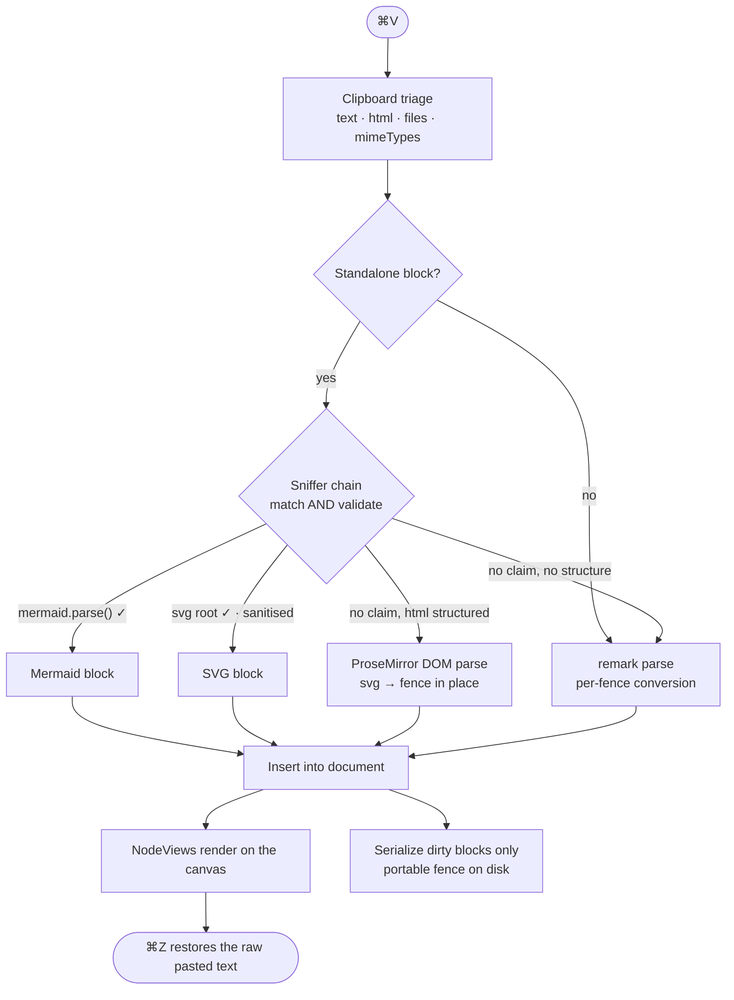

# SimpleMark — Design Document

- **Status:** Draft, revision 5 — rendered-document POC governed by
  [`ADR-0005`](decisions/0005-rendered-document-before-agent-participation.md)
- **Date:** 2026-08-02
- **Working title:** SimpleMark
- **One line:** The beautiful living document for AI work: always rendered, always your file.

---

> **[`PRODUCT.md`](PRODUCT.md) is the product authority.** AI composes Markdown; the human reads,
> judges, and occasionally corrects the result. This document specifies the local rendered canvas
> and source-preserving machinery that make that experience trustworthy. Agent participation and
> collaboration are later capabilities, not the default surface or the first product proof.

---

## 1. What this is

Codex, Claude, and other tools already produce useful plans, research, specifications, and reports
as Markdown. Reading those artifacts in a terminal, IDE preview, chat transcript, or visible source
editor is needlessly poor.

SimpleMark opens the original local file directly as a beautiful technical document. It keeps the
page rendered while an external agent updates the file and reveals source only for the exact thing
the human chooses to correct. There is no vault, workspace, provider setup, chat panel, session
manager, or source/preview mode.

Bear got document feel right but does not render the full technical artifact. Obsidian and similar
tools render more but ask the user to enter a vault and manage an authoring environment. AI
workspaces expose the machinery for operating agents. SimpleMark keeps the artifact at the center.

**The defining behavior:** an agent writes `plan.md`; SimpleMark shows the same file as a polished,
living document and updates it without losing the reader's place. Mermaid, SVG, math, tables, and
code are part of the page. One click permits a small correction; the page returns to rendered form.

---

## 2. Architectural decisions

These are the load-bearing choices. D3 is the only one gated on a spike; see §12.
Repository structure and dependency direction are governed by
[`ADR-0001`](decisions/0001-single-product-modular-architecture.md): one product repo and package,
with enforced internal modules rather than either a monorepo or monolithic application code.

### D1 — Files are the truth

Notes are plain `.md` files in a folder the user picks. SQLite is a rebuildable cache (search index, link graph, thumbnails) and never authoritative.

**Consequence:** zero lock-in is literally true, not a promise. Every feature must round-trip to Markdown or it does not ship — subject to the fidelity contract in D7 and the portability tiers in §5.

**Amended by D8, ADR-0002, and ADR-0005:** while a document is open, the application
`DocumentSession` coordinates the rendered state, human corrections, and accepted external-file
updates; the file remains the durable artifact. A future direct-agent or multi-client session may
expand that coordinator only after its evidence gate passes.

### D2 — Sync is delegated to the cloud drive

No CRDT, no relay server, no accounts, no hosting bill. The notes folder lives in iCloud Drive (or Dropbox, or any synced folder) and the OS handles propagation.

**Accepted costs:**
- Simultaneous offline edits on two devices produce a `(conflicted copy)` file. Handled per §8.
- No real-time collaboration. Not wanted.
- iOS is the weak spot: iCloud Drive works via the file provider; Dropbox and Google Drive on iOS are apps rather than filesystems and background folder sync is unreliable. ~~**iCloud Drive is the supported iOS path.**~~ **Superseded by [ADR-0006](decisions/0006-one-authoritative-change-stream.md):** external bytes reach the document through a source-specific adapter, so the supported path is whichever provider an adapter can read honestly — never inferred from a provider name or path.

**Amended by D8, ADR-0002, and ADR-0005:** external file propagation is the first agent integration:
the agent writes the ordinary file and SimpleMark watches it. This is not real-time peer transport.
Direct participant transport and offline merge remain deferred with their later gates.

### D3 — Milkdown as the editor core *(gated on the §12 spike)*

Milkdown (MIT) sits on ProseMirror + remark. Its premise is Markdown-AST-as-truth with the editor as a view over it — which is D1 expressed as a library.

**This decision is not final.** D7 imposes a fidelity requirement that no off-the-shelf Markdown editor satisfies out of the box. The spike in §12 determines whether Milkdown can be extended to meet it or whether the document model has to be built on raw ProseMirror + a source-mapping layer.

Tiptap was the alternative and fails the same test for the same reason; the choice is really "Milkdown vs. hand-rolled source-preserving model," and both are ProseMirror underneath, so schema and NodeViews port either way.

### D4 — A single unified canvas

No source pane, no preview pane, no mode toggle. Editing and rendering happen in the same view. Click a rendered diagram to reveal its source inline.

### D5 — Internal extension points in v1; public plugin API deferred

Mermaid, SVG, code highlighting, tables, and wikilinks are written against one internal extension interface, and that interface is designed to become the public API. If a built-in needs a hook the interface doesn't expose, the interface is wrong.

**What is deliberately not in v1:** third-party plugin loading. A real public plugin runtime needs execution isolation, a versioned and migratable schema contract, defined behavior when a note references an unavailable plugin, and enforcement of declared capabilities at the native boundary — not merely their declaration. That is a subsystem, and shipping it before the document model is proven risks freezing the wrong API forever.

Opening the API later is then a decision, not a rewrite. Handwriting + OCR is the first intended external plugin and lands after the API opens.

### D6 — Typography is a document-level setting

Per-selection font, size, and colour cannot be expressed in Markdown, so they do not exist. Bear works the same way: font family, size, line height, line width, and theme are preferences. The toolbar handles structure and emphasis only.

### D7 — Fidelity contract: source preservation, not re-serialization

**Untouched content is never rewritten.** Opening a note and saving it must produce a byte-identical file. Editing one paragraph must not renumber lists, restyle fences, repad tables, or normalize bullets elsewhere in the document.

Byte-identical round-trip through a general Markdown serializer is not achievable — remark normalizes bullet markers, table padding, fence style, setext headings, entity escaping, and blank-line runs. So fidelity is defined in two tiers:

| Tier | Scope | Guarantee |
|---|---|---|
| **Preserved** | Blocks the user did not edit this session | Original source text is retained and re-emitted verbatim |
| **Normalized** | Blocks the user edited | Serialized by remark; semantic equivalence only, house style applied |

**Implementation:** every top-level block node carries the byte range of its original source. Clean blocks re-emit that slice. Dirty blocks serialize. Front matter, arbitrary embedded HTML, and unknown constructs are always preserved as opaque source, never round-tripped through the AST.

The fence info tail (```` ```svg width=320 ````) is part of those bytes: the
editor's `code_block` schema carries it as a `meta` attribute and serialises
it back verbatim.

This is the hardest requirement in the project and the reason §12 exists.

**Refined by ADR-0002.** `originalSource` is an immutable baseline, not collaborative text. Dirty is
monotonic within a save epoch. Once touched, a block ignores its baseline and serializes current
structured content; only a successful save creates a new baseline. The ten acceptance fixtures
apply unchanged.

---

## 3. System architecture

```
┌─ Shells ─────────────────────────────────────────────┐
│  Tauri (macOS first, then Win/Linux)                 │
│  Capacitor (iOS/iPad — deferred)                     │
│  provides: filesystem, file watcher, pen events,     │
│            share sheet, native menus                 │
└──────────────────┬───────────────────────────────────┘
                   │  NativeBridge (one narrow interface)
┌──────────────────▼───────────────────────────────────┐
│  src/domain  (TypeScript, pure; no DOM/frameworks)   │
│  source model · transactions · recognition contracts │
│  generation fences · portable document rules         │
└──────────────────▲───────────────────────────────────┘
                   │
┌──────────────────┴───────────────────────────────────┐
│  src/application                                     │
│  DocumentSession · open/save · invoke/stop/revert     │
│  ports implemented by adapters                       │
└──────────────────▲───────────────────────────────────┘
                   │
┌──────────────────┴───────────────────────────────────┐
│  src/adapters                                        │
│  editor · filesystem · renderers · MCP                │
│  deferred collaboration adapter                       │
└──────────────────▲───────────────────────────────────┘
                   │
┌──────────────────┴───────────────────────────────────┐
│  src/app  UI shell + the single composition root     │
└──────────────────────────────────────────────────────┘
```

This is one root package and one application release. Each module has one job and a typed public
entry point. Domain and application tests run under Node without DOM, Tauri, Yjs, or MCP; adapters
are tested against the ports they implement. CI rejects dependency cycles and imports across module
internals.

---

## 4. The paste pipeline

Paste recognition supports direct correction and human additions. The primary path is opening an
existing AI-generated file; paste is valuable, but it is not the product definition.

```
Cmd+V
 │
 ├─ 1. Clipboard triage
 │      collect {text, html, files, mimeTypes}
 │
 ├─ 2. Sniffer chain          ← extensions register here
 │      svg-in-html · svg · mermaid · image · (built-ins only in v1)
 │      first sniffer to MATCH, VALIDATE and pass the
 │      standalone-block test wins
 │
 ├─ 3. No sniffer hit → structured HTML: ProseMirror parses the DOM
 │      (SVG becomes an svg fence in place); else remark parses text/plain as Markdown
 │
 └─ 4. Insert into the document → NodeViews render
        one Cmd+Z restores the raw pasted text
```

### 4.1 Sniffer contract

```ts
interface PasteSniffer {
  id: string
  priority: number
  sniff(input: ClipboardInput, ctx: PasteContext): AstNode | null
  // must validate; must not throw
}
```

### 4.2 Conversion rules — deterministic, in order

A sniffer may convert **only** when all four hold:

1. **Standalone block.** The caret is at a block boundary and the pasted text is the entire clipboard payload. Pasting into the middle of a sentence never converts — it inserts text.
2. **Signature match.** Mermaid: first non-blank line matches
   `/^\s*(flowchart|graph|sequenceDiagram|classDiagram|stateDiagram(-v2)?|erDiagram|journey|gantt|pie|gitGraph|mindmap|timeline|quadrantChart)\b/`.
   SVG: parses as XML with an `<svg>` root.
3. **Validation succeeds.** `mermaid.parse()` returns without throwing; SVG survives sanitisation (§7).
4. **No higher-priority sniffer claimed it.** Priority order is fixed: `svg-in-html (30) → svg (20) → mermaid (10) → image (5)`.

**Named ambiguous cases and their rulings:**

| Case | Ruling |
|---|---|
| Clipboard has `text/html` wrapping an `<svg>` | `svg-in-html` claims it. HTML path is not consulted. |
| Clipboard `text/html` carries document structure (a heading, list, table, two or more paragraphs, or any mark) | **HTML path.** Real headings, marks, lists and tables. An inline `<svg>` becomes an `svg` block in place. |
| Clipboard `text/html` references remote images | **HTML path, then local.** The faithful paste lands with its remote URLs; each image is downloaded into `assets/` beside the note and its reference rewritten to `` by a later transaction, outside undo history ([`ADR-0008`](decisions/0008-pasted-images-become-local-files.md)). A download that fails or is declined keeps the remote URL, visibly unchanged. |
| Clipboard `text/html` is a whole web page wrapped around an article | **HTML path, unchanged, plus an explicit offer.** A dismissible "trim page chrome?" bar appears; accepting replaces the pasted range in one undoable step with the extracted article, and a source URL detected in the clipboard is prepended as `> Source: …`. Never automatic, and declining leaves the faithful paste. |
| Clipboard `text/html` is only a wrapper, or absent | Markdown path on `text/plain`. A plain-text copy of Markdown source must still parse as Markdown (BUG-1). |
| Multi-block paste (prose + a ```mermaid fence + a table) | Markdown path. Fences convert per-block after parsing. Bare unfenced diagram source inside a larger paste stays text. |
| Prose beginning with the word "graph" | `mermaid.parse()` rejects it; stays text. |
| Valid Mermaid quoted inside a paragraph | Fails the standalone-block test; stays text. |
| User wants literal source | `⌘⇧V` pastes as plain text, always, with no sniffing. Permanent, not transient. |

### 4.3 Reversibility, in both directions

- `⌘Z` immediately after conversion restores the raw pasted text.
- A "keep as plain text" affordance appears in the block corner for a few seconds after insertion.
- **"Convert to diagram" is always available** as a slash command and context-menu action on any code block or paragraph — so a missed conversion is one command away, not a re-paste.

### 4.4 Three rules that make it feel like magic rather than a trick

1. **Never guess silently wrong** — conversion requires successful parse.
2. **Never lose the source** — the block stores the original text and writes a normal fenced code block to disk.
3. **Fail visibly** — broken diagram source renders an inline error card with the parser message, never a blank rectangle.

### 4.5 Mermaid source editor acceptance matrix

The first Mermaid NodeView uses a plain textarea as an explicit editable island. CodeMirror 6 is an
optimization only after this behavior passes; it is not required for the POC.

| Behavior | Required result |
|---|---|
| Enter source mode | Clicking the render focuses the source editor without moving the outer selection unexpectedly |
| Exit source mode | Escape or click-away commits one outer-document transaction and returns focus predictably |
| Selection boundary | A selection never silently spans from outer prose through the isolated source editor |
| Arrow navigation | Left/right/up/down at the source edges enter or leave the block intentionally |
| Paste and IME | Paste, composition, emoji, and dead-key input produce one valid block update |
| Undo/redo | Inner typing participates in the block edit; outer undo restores content and a sensible focus position |
| Delete boundary | Backspace/Delete at an empty or selected block cannot strand the cursor or corrupt adjacent blocks |
| Remote/session update | `update` refreshes source without recreating the NodeView or stealing focus |
| DOM observation | `stopEvent` and `ignoreMutation` prevent inner control activity from causing outer selection churn |
| Reopen | Saved fenced source recreates the same render and editable source |

Do not persist CodeMirror selection as Markdown or document content merely to repair undo. If richer
selection restoration is needed, keep it as ephemeral session/UI state. The NodeView must explicitly
bridge edits and focus; ProseMirror cannot infer selections inside an opaque nested editor.

---

## 5. Document format and portability tiers

"Everything round-trips to Markdown" is true, but not everything round-trips to *someone else's* Markdown. The format is tiered explicitly.

| Tier | Constructs | Portability |
|---|---|---|
| **1 — CommonMark / GFM** | headings, lists, tables, links, emphasis, task lists, fenced code, ` ```mermaid ` blocks | Renders correctly in GitHub, Obsidian, Bear, any editor. Mermaid renders as a diagram on GitHub and as a labelled code block elsewhere. |
| **2 — SimpleMark extensions** | `[[wikilink]]`, `![[attachment]]` embeds, `#tag/subtag` | Valid Markdown text; degrades to visible literal text elsewhere. Documented as extensions, not presented as standard. |
| **3 — Sidecar-backed** | ink strokes, future plugin binary data | Reference plus a rendered fallback |

**Degradation rules:**

- A wikilink is written `[[Note Title]]` and remains legible as text in any reader. An option emits `[Note Title](note-title.md)` instead for users who prioritise portability over Bear-style syntax.
- Any sidecar-backed block **must also write a rendered raster fallback** and reference it with standard Markdown image syntax, so another app shows the drawing rather than a broken embed:
  ```markdown
  
  <!-- simplemark:ink source=attachments/9f3a2b.strokes.json -->
  ```
  The HTML comment carries the editable source and is invisible everywhere else.
- Front matter is preserved verbatim and never reordered.

---

## 6. Rendered document surface

The document is the default and persistent state. Markdown punctuation is not shown merely because
the user moved the cursor. A click selects or enters the exact sentence or block being corrected;
source controls disappear again when that correction ends.

**The document remains the primary surface, inside a calm three-pane workspace when a notes folder
is open.** The left pane is a small folder/source list; the middle pane is a spacious, Bear-like
note index (title, one-line preview, modified time, and a quiet pin); the right pane is the document. The index is
derived from the Markdown folder, never a second source of truth. Both panes can collapse into a
single-document focus view. There is no permanent activity, chat, agent, or inspector rail.

**Permanent** is the operative word, and it is what the anchored-notes rail
([`ADR-0007`](decisions/0007-annotation-before-participation.md)) is measured against. That rail
exists only while a note in this document is unresolved: no open threads, no rail — absent from the
layout, not present and empty. A document with nothing outstanding is the three panes above and
nothing else. A rail that were merely *usually* empty would fail this rule; one that does not exist
does not.

The note index and document are independent scroll surfaces. The document keeps a quiet, persistent,
proportional position indicator: its thumb length shows how much of the document is visible, its
position shows the reader's place, and dragging it navigates the real document scroll range.

Links are ordinary portable Markdown. `design.md`, `../research/source.pdf`, and
`assets/diagram.svg` are stored unchanged and resolved from the open note's folder at click time;
moving or syncing that folder to another device therefore preserves the relationship. Linked
Markdown opens in the same SimpleMark window, web URLs open in the system browser, and other local
files open in their system application. `file:///...`, `/Users/...`, drive-letter paths, and `~`
paths are explicitly machine-specific and are rejected with a visible explanation.

The shared web surface owns these panes, note selection, search, and focus mode. The native shell
owns macOS window chrome, menus, filesystem access, and watching. In particular, the web view must
never draw imitation traffic lights or an imitation macOS menu bar.
The web starts with its compact formatting strip visible; native starts without it because the macOS
menus already expose those commands. View can restore the strip when wanted.

Stable shell choices are local preferences and restore across composition reload and app reopen.
That includes pane layout, reader and whole-page zoom, visible reader tools, note-list presentation,
column widths, active collection, and native window geometry. Transient interaction state is not
restored, and none of this presentation state is written into Markdown. Pinch uses platform page
magnification for the complete canvas; Command-plus/minus remain reader-text controls; Command-zero
restores both magnifications to 100 percent.

**Formatting bubble** on selection, plus keyboard shortcuts and live input rules (`**bold**` renders as you type):

bold · italic · strikethrough · highlight · inline code · H1–H3 · bullet list · numbered list · checkbox · quote · link · code block · divider

Built from `@milkdown/preset-commonmark` + `@milkdown/preset-gfm`, `@milkdown/kit/plugin/tooltip` (Floating UI positioned), `@milkdown/kit/plugin/slash`, `prosemirror-keymap`, `prosemirror-inputrules`. Icons from Lucide (MIT).

**Typography preferences** (D6): font family, size, line height, line width, theme (light/dark/auto), with a curated set of text faces rather than a system font dump.

Typography, scroll position, selection, table overflow, and rendered-block stability are product
acceptance criteria. External file refresh must not replace the whole DOM, flash the page, move a
reader who is above the changed block, or reveal raw source.

---

## 7. Security

SVG and embedded HTML are untrusted input. A pasted `<svg>` can carry `<script>`, `onload=`, `<foreignObject>`, and external references.

- All SVG passes **DOMPurify** with the SVG profile before rendering; scripts, event handlers, `foreignObject`, and external references are stripped. Sanitisation runs before validation, so an SVG that only survives by being neutered still renders — neutered.
- Rendered content runs under a strict CSP; note content never issues network requests.
- Mermaid runs with `securityLevel: 'strict'` (HTML labels disabled).
- Extensions declare capabilities today; **enforcement at the native boundary is a prerequisite for opening the API to third parties** (D5), not something declared capabilities provide on their own.

---

## 8. Files, writes, and conflicts

D2 buys simplicity by putting a cloud daemon and the app in the same directory. That has to be handled deliberately.

**Write discipline**

- **Atomic writes only:** serialize to `<name>.md.tmp` in the same directory, `fsync`, then `rename()` over the target. A partially-written note is never observable.
- **Write-loop suppression:** the vault records the hash and mtime of every file it writes and ignores watcher events matching them, so the app never reacts to its own save.
- **Debounced save on pause and on blur**, not per keystroke — fewer versions for the cloud daemon to fight over.

**Identity**

- A note's identity is a stable id in front matter (`id: 01J…`), not its path. Renaming a file on another device is a rename, not a delete-plus-create, and wikilinks and backlinks survive it.
- Title-based `[[wikilinks]]` resolve through the link graph to ids; a title change rewrites referring notes and records the old title as an alias.

**External change and conflict**

| Situation | Behavior |
|---|---|
| File changed on disk, editor clean, note not focused | Reload silently |
| File changed on disk, editor clean, note **focused** | Do not yank the view. Show an unobtrusive "Updated on another device — Reload" bar. |
| File changed on disk, editor dirty | Keep local state; offer a side-by-side diff |
| File appears mid-write (size 0, truncated, or hash unstable across two reads 250 ms apart) | Ignore and re-check; never parse a file the daemon is still writing |
| `(conflicted copy)` file appears | Surface in the note list with a diff view: keep mine / keep theirs / merge |
| Attachment orphaned by a merge | Retained, swept by a background job after 30 days, never deleted inline |

---

## 9. Error handling and testing

### 9.1 Failure behavior

| Failure | Behavior |
|---|---|
| Diagram source does not parse | Inline error card with the parser message; source stays editable |
| Sniffer throws | Skipped, logged; paste falls through to Markdown |
| NodeView throws | Block renders as a fenced code block; extension marked unhealthy |
| Index corrupt or missing | Silently rebuilt from the folder |
| Unknown `simplemark:` construct in a file | Preserved verbatim, rendered as its fallback |

The governing rule: **failures are visible and local.** No silent fallbacks, no blank rectangles, no crash on bad input.

### 9.2 Tests

- **Fidelity suite (the important one).** For each fixture: open → save untouched → assert byte-identical. Then: edit one block → assert every other block is byte-identical and the edited block is semantically equivalent. Fixtures listed in §12.
- **Sniffer table tests** — every row of the §4.2 ruling table, plus XSS payloads and malformed SVG.
- **Vault tests** — scan, watch, atomic write, write-loop suppression, external edit, mid-write file, rename, conflicted copy, orphan sweep. DOM-free, fast.
- **Extension conformance** — built-ins compile against the internal interface only; a lint rule forbids private imports.
- **Visual regression** on editor chrome and the three renderers.

---

## 10. Wireframe

Interactive versions: [`wireframe.html`](wireframe.html) retains the richer lifecycle exploration;
[`wireframe-bear.html`](wireframe-bear.html) establishes the warm reading treatment. The current
application direction uses that document surface inside the compact three-pane layout above, without
adopting a permanent inspector or activity rail. Its top formatting strip is present by request, but
the page remains the primary surface.
The approved pane behavior, observed Bear menu inventory, native/shared command boundary, and
delivery order are specified in [`NATIVE-WORKSPACE.md`](NATIVE-WORKSPACE.md).
The original wireframe's **AI working**,
**Redirecting**, and **Stopped** states illustrate a later capability and are not the first product
surface under [`ADR-0005`](decisions/0005-rendered-document-before-agent-participation.md).

### 10.1 Main window

The first runnable browser build uses a clearly labelled in-memory demo workspace; it proves the
shared shell without claiming browser fixture notes are a chosen folder. Native and folder-capable
browser adapters replace that fixture with a scanned local folder. Reader preferences and file
actions live in restrained window chrome. A single narrow formatting strip remains at the top
by explicit product choice: it contains only real, everyday document commands (heading level,
emphasis, lists, checklist, table, link, and technical-block insertion). It is not a second pane,
mode switcher, or an excuse to expose every implementation capability.

There is no agent pane, activity sidebar, model picker, or chat panel.
The first integration is the watched file: an external agent changes it and the rendered document
updates calmly. A quiet update marker may identify changed content temporarily, but it may not turn
ordinary refresh into a review queue.

The conditional anchored-notes rail is not an exception to that sentence. It carries a human's own
notes on this document and nothing else — no agent, no model, no run state, no activity feed — and
it is absent whenever nothing is unresolved.

The following passage interaction is retained only as a later agent-participation design:

Redirect opens the passage conversation in place:

```text
Passage conversation                         live · anchored here
  Codex  I'm turning this into a three-step system diagram.
  You    Keep Markdown at the center. Hide the sync machinery.

  [Redirect now] [Leave note]
  To Codex  Make the document—not the session—the center  [Send redirect]
```

The two modes must never be conflated. **Redirect now** is control: it fences the old AI
generation and starts a replacement. **Leave note** is communication: it appends an anchored,
asynchronous message and interrupts nobody. Humans and AI use the same conversation surface, but
only an explicit control changes an agent run.

### 10.2 Rendered block anatomy

Every extension-rendered block shares one frame, so a future third-party block is indistinguishable from a built-in:

```
┌─────────────────────────────────────────────────────┐
│ ⟨type⟩                                               │  ← language label, on hover
│                               [Edit source] [Delete] │  ← chip toolbar, on selection
│              rendered output (NodeView)              │  ← extension owns this rect
└─────────────────────────────────────────────────────┘
```

**Resolved by [`ADR-0003`](decisions/0003-rendered-block-frame.md)** during the first UI pass (EDITOR-1): the frame stays. Hover now reveals only the language label in the corner; the block's own controls are a chip toolbar that appears once the block takes the selection, not a bar that fades in on hover. A diagram-capable block (svg or a generated chart) adds a zoom pill and a float segment to the same row, plus a resize grip at the corner, while it is selected — nothing sits in the frame permanently.

### 10.3 Block movement and continuation

Every top-level document block has a quiet six-dot drag handle that appears on hover or focus.
Dragging that handle reorders blocks; it does not turn the page into a permanent page-builder. A
visible insertion position exists between every two blocks and after the last block. Clicking there,
pressing Enter at a block boundary, or navigating by keyboard must create or focus an ordinary
writable paragraph outside embedded source, diagram, table, or code NodeViews.

This is a correctness rule as much as an editing convenience: a terminal diagram or other rendered
block may never trap the caret or cause a subsequent paste to modify its underlying source. The
document must always have a usable continuation point.

The contextual source sheet for a rendered block opens over the current viewport and can be dragged
or resized out of the way. It has usable minimum and viewport bounds, and its editor grows with the
sheet. It is temporary, remains attached to exactly one block, and closes back to the rendered
document; it is not a persistent inspector panel.

### 10.4 Paste sequence



### 10.5 Visual identity

Warm paper and restrained amber keep the notebook familiar without impersonating Bear or Apple
Notes. Agent presence has a separate violet token so scope and attribution are recognizable without
recolouring the document. Serif body text (Iowan Old Style / New York / Palatino / Georgia) keeps
long notes readable; system sans is reserved for titles and chrome, and monospace for source and
provenance. Controls fade into the page until they are relevant.

---

## 11. Sequencing and v1 scope

Proof of the hard promise comes before the pretty part.

### Phase 0 — Source-preservation spike (go/no-go, days)

Detailed in §12. Nothing else starts until it resolves D3.

### Phase 1 — Beautiful living document POC (weeks)

The only post-gate implementation target is `POC.md`. One thin path, end to end,
polished where the reader can see it:

> external agent writes one local file → open directly → render beautifully → update in place when
> the file changes → correct one sentence → save → reopen clean Markdown

This exercises the source map, NodeViews, reader continuity, file watching, external-change import,
atomic writes, and contextual editing. It deliberately does **not** exercise MCP, an in-app agent,
chat, activity, generation fences in the UI, Yjs, cloud sync, remote peers, or offline merge.

### Phase 2 — Technical renderer breadth and daily-use shell

Mermaid, SVG, KaTeX, tables, Shiki code, typography preferences, open/recent files, and the smallest
correction tools required for daily use. Tags, note libraries, backlinks, and multi-pane knowledge
management are not implied.

### A and B — Anchored notes and resolve

Highlight a passage, capture a note, reopen and find it still there — or find it in the rail saying
what it was on, rather than slid onto a neighbouring paragraph. Resolving closes a thread and writes
nothing to the document. No agent, no authority, no participant, and no rail when nothing is
unresolved. Not gated on the `POC.md` trial, because it puts nobody in the document
([`ADR-0007`](decisions/0007-annotation-before-participation.md)).

### C0, C and D — Optional in-app agent participation

`ADR-0007` splits what this section used to call Phase 3. **C0** is the unresolved one: a provider,
model and key without a cockpit. **C** lets an agent answer in a thread without the right to edit.
**D** compares scoped, attributed `DocumentSession` transactions against the simpler external-file
workflow — proceed only if direct participation is materially faster or safer without making the
document feel like an agent cockpit. The existing MCP, fence, Stop, Redirect, and revert designs
govern that test.

### Phase 4 — Multi-client authority decision

Connect two version-pinned ProseMirror clients. Test native step collaboration first using Pitter
Patter Collab or `prosemirror-collab-commit`; compare Yjs only if masterless operation is required.
Prove structural convergence, schema enforcement, anchors/decorations/NodeViews, separate undo,
contention and reconnect, history bounds, and safe source-baseline/save leadership before remote work.

### Deferred (designed for, not built)

Public plugin API and sandbox · handwriting + OCR · iOS/iPad shell · graph view · Windows/Linux · encryption · theme gallery.

---

## 12. The go/no-go spike

**D3 is the project's strongest technical dependency and it is unresolved.** This is a blocking gate, not a curiosity.

**Question:** can Milkdown be extended to satisfy D7 — preserve untouched source byte-for-byte while normalizing only edited blocks — or does the document model have to be built directly on ProseMirror with a source-mapping layer?

**Method:** load each fixture, save without editing, diff. Then edit exactly one block and diff everything else.

**Acceptance fixtures:**

| # | Fixture | Tests |
|---|---|---|
| 1 | The Switchboard borrowing-map document | Real hostile input: nested tables, inline links in cells, anchors, mixed lists |
| 2 | YAML front matter with comments and unusual ordering | Preservation without reordering |
| 3 | Arbitrary embedded HTML (`<details>`, ``, raw `<svg>`) | Opaque preservation |
| 4 | Deeply nested and mixed-marker lists (`-`, `*`, `1.`, `1)`) | No marker normalization |
| 5 | Tables with ragged padding and alignment rows | No repadding |
| 6 | Reference-style links and footnotes | Definitions stay where the author put them |
| 7 | Fenced code with `~~~`, backtick counts > 3, and nested fences | Fence style preserved |
| 8 | A ```mermaid block plus a bare pasted diagram | Conversion and serialization agree |
| 9 | Hard tabs, CRLF, trailing whitespace, no trailing newline | Byte-level faithfulness |
| 10 | Externally edited file re-opened mid-session | Source map rebuilds correctly |

**Pass:** fixtures 1–10 are byte-identical on untouched save, and a single-block edit leaves all other blocks byte-identical.

**Fail:** rebuild the document model on ProseMirror with an explicit source map. Cost is weeks, not months, and the spike's fixtures carry over unchanged.

### Other open questions (non-blocking)

1. Whether Dropbox and Google Drive can be supported on iOS at all, or whether iCloud Drive is the only viable mobile path.
2. ~~Whether rendered blocks are framed or bare (§10.2).~~ Resolved by [`ADR-0003`](decisions/0003-rendered-block-frame.md).

---

## 12b. Companion specifications

| Document | Covers |
|---|---|
| [`COLLABORATION.md`](COLLABORATION.md) | **The optional live session** — the Conversation layer's human half first, then a local `DocumentSession`, then a gated multi-client authority decision |
| [`TECH-SPEC.md`](TECH-SPEC.md) | Universal paste — the five-level recognition ladder, the signed renderer catalog, sandboxed execution, and why pasted content may never choose what code runs |
| [`RENDERERS.md`](RENDERERS.md) | Renderers vs embedded editors, the rule for choosing, and the v1 set: Mermaid, DOT, KaTeX, Shiki, Vega-Lite, Markmap |
| [`PRODUCT.md`](PRODUCT.md) | **The product authority** — job, user, category difference, default experience, sequencing, and language |
| `POC.md` | The renderer-first next executable target and its acceptance test |
| [`MCP-SERVER.md`](MCP-SERVER.md) | **The agent contract** — one tool surface for open and unopened notes, participants and capabilities, rebase concurrency, the fence, and attention rules |
| `AGENT-WORKSPACE.md` | MCP co-editing — safety posture and build rationale. Its §3–§4 tool surface is superseded by [`MCP-SERVER.md`](MCP-SERVER.md) |

---

## 13. Licensing

**Apache-2.0 or MIT.** Permissive licensing keeps a future hosted service, a proprietary extension, or commercial redistribution possible without relicensing the project.

This is the honest reason the copyleft alternatives were not used as a starting point. Zettlr (GPL-3.0) and Logseq (AGPL) are freely forkable — copyleft permits forks; it imposes obligations on distribution. Building on them would bind SimpleMark and anything shipped with it to the same terms. That is a legitimate choice, just not this project's.

Milkdown (MIT), ProseMirror (MIT), remark (MIT), Shiki (MIT), Lucide (MIT), DOMPurify (Apache-2.0/MPL), and Tauri (MIT/Apache-2.0) are all compatible.
