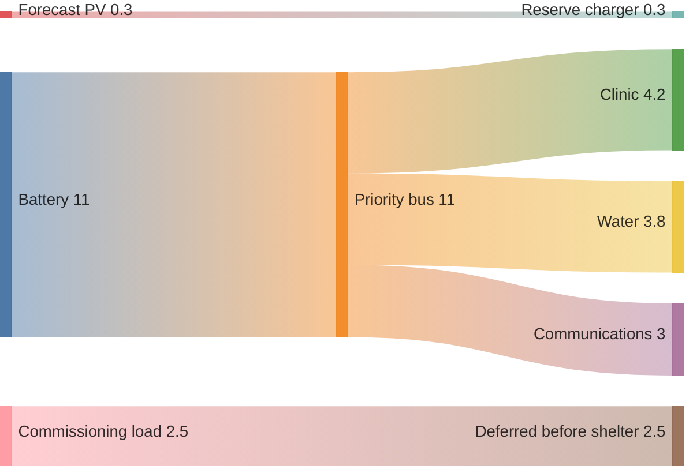
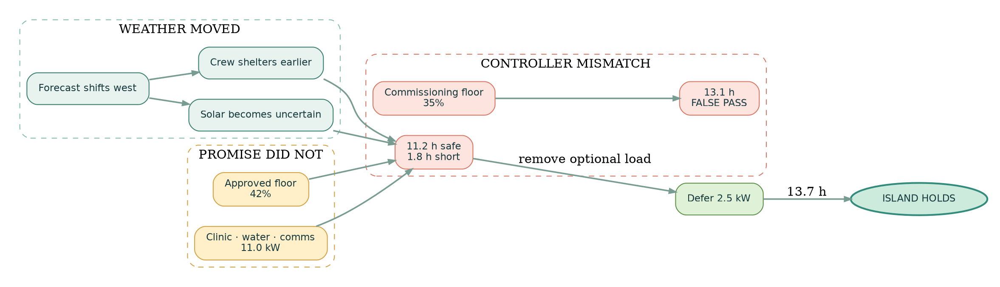
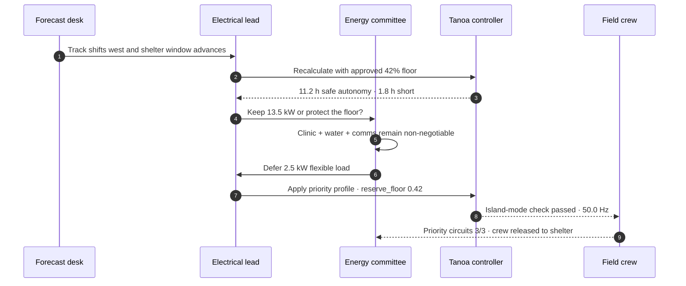

# Project Tanoa: the storm atlas

*Fulaga Community Energy Committee · fictional commissioning watch · 2032*

> [!IMPORTANT]
> **Fourteen minutes remain before the crew shelters.** The storm has crossed the handover window. The committee must decide whether to keep commissioning—or keep its promise to the island.

Fulaga's new solar and battery microgrid spent the year in testing while a field crew ran final checks before handing it over to the island for good. The last test is islanding, where the system is cut off from external power to run entirely on its own battery, solar panels, and inverter. Testing allows for flexibility that regular operation won't: extra loads draw power alongside real ones, and emergency reserves can sit lower than the community's normal limit. On a calm week, that isn't a problem, but an incoming cyclone changes the math.

Three days earlier, the final equipment check passed without issue. Then, 24 hours out, the forecast shifted west and turned a routine schedule into an emergency. With 14 minutes left until cutoff, the battery was charged, the inverter was ready, and the crew was preparing to take shelter, but the numbers behind them were wrong. The controller was treating seven percent of the community's emergency reserve as available power to spend.

This is the story of the 14 minutes it took to catch that mistake, and what the committee decided to do about it.

**Project Tanoa is a fictional design scenario.** Its 2032 storm, weather field, equipment, telemetry, asset positions, committee, loads, and outcome do not describe present conditions on Fulaga. The island geometry is sourced from OpenStreetMap; every operational layer is invented for this demonstration.

---

## I. The weather moved first

The forecast didn't look dramatic at first, but it quickly grew urgent. High winds cut into the crew's setup time, rain canceled the day's inspection, and heavy clouds reduced the expected solar output. With every update, the deadline to go independent moved up.

```vega-lite
{
  "$schema": "https://vega.github.io/schema/vega-lite/v6.json",
  "background": null,
  "spacing": 22,
  "vconcat": [
    {
      "width": 760,
      "height": 360,
      "title": {
        "text": "The storm is turning into the handover window",
        "subtitle": "Fulaga · fictional T−12 h wind field and forecast track · circles show forecast gusts",
        "anchor": "start",
        "color": "#173a3f",
        "subtitleColor": "#5d7770"
      },
      "projection": {"type": "mercator"},
      "layer": [
        {
          "data": {
            "values": [
              {
                "type": "Feature",
                "properties": {"name": "display extent"},
                "geometry": {
                  "type": "Polygon",
                  "coordinates": [[
                    [-178.67, -19.20], [-178.67, -19.00], [-178.25, -19.00],
                    [-178.25, -19.20], [-178.67, -19.20]
                  ]]
                }
              }
            ]
          },
          "mark": {"type": "geoshape", "fill": "#082f39", "stroke": null}
        },
        {
          "data": {
            "values": [
              {"lon": -178.62, "lat": -19.18, "gust": 95},
              {"lon": -178.56, "lat": -19.18, "gust": 104},
              {"lon": -178.50, "lat": -19.18, "gust": 118},
              {"lon": -178.44, "lat": -19.18, "gust": 132},
              {"lon": -178.38, "lat": -19.18, "gust": 145},
              {"lon": -178.62, "lat": -19.15, "gust": 100},
              {"lon": -178.56, "lat": -19.15, "gust": 112},
              {"lon": -178.50, "lat": -19.15, "gust": 128},
              {"lon": -178.44, "lat": -19.15, "gust": 148},
              {"lon": -178.38, "lat": -19.15, "gust": 162},
              {"lon": -178.62, "lat": -19.12, "gust": 106},
              {"lon": -178.56, "lat": -19.12, "gust": 120},
              {"lon": -178.50, "lat": -19.12, "gust": 139},
              {"lon": -178.44, "lat": -19.12, "gust": 160},
              {"lon": -178.38, "lat": -19.12, "gust": 174},
              {"lon": -178.62, "lat": -19.09, "gust": 102},
              {"lon": -178.56, "lat": -19.09, "gust": 116},
              {"lon": -178.50, "lat": -19.09, "gust": 133},
              {"lon": -178.44, "lat": -19.09, "gust": 151},
              {"lon": -178.38, "lat": -19.09, "gust": 166}
            ]
          },
          "mark": {"type": "circle", "opacity": 0.30, "stroke": "#f8edda", "strokeOpacity": 0.18},
          "encoding": {
            "longitude": {"field": "lon", "type": "quantitative"},
            "latitude": {"field": "lat", "type": "quantitative"},
            "size": {
              "field": "gust",
              "type": "quantitative",
              "scale": {"domain": [90, 180], "range": [180, 2100]}
            },
            "color": {
              "field": "gust",
              "type": "quantitative",
              "title": "Gust km/h",
              "scale": {"domain": [90, 180], "range": ["#73c8bb", "#f0c36a", "#ef7865"]},
              "legend": {
                "orient": "top",
                "direction": "horizontal",
                "gradientLength": 240,
                "labelColor": "#40514d",
                "titleColor": "#40514d"
              }
            }
          }
        },
        {
          "data": {
            "values": [
              {
                "type": "Feature",
                "properties": {
                  "name": "Fulaga",
                  "source": "OpenStreetMap relation 3521053"
                },
                "geometry": {
                  "type": "Polygon",
                  "coordinates": [[
                    [-178.5969472,-19.1200228],[-178.5969646,-19.1201381],[-178.59697,-19.1202053],[-178.5969522,-19.1202512],[-178.5969499,-19.1202572],[-178.5969123,-19.1202762],[-178.596864,-19.1202914],[-178.596848,-19.1203231],[-178.596856,-19.1203687],[-178.5968962,-19.1204029],[-178.5969512,-19.1204156],[-178.5970317,-19.1204029],[-178.5970773,-19.1204143],[-178.5971215,-19.1204524],[-178.5971497,-19.1205423],[-178.5972463,-19.1209769],[-178.5973495,-19.1214965],[-178.5973817,-19.121684],[-178.5973871,-19.1218031],[-178.597371,-19.1218981],[-178.5973763,-19.1219653],[-178.5974032,-19.1220236],[-178.5974836,-19.1220958],[-178.5975467,-19.1221997],[-178.5975949,-19.1223581],[-178.597666,-19.1226559],[-178.5977063,-19.1228839],[-178.5977197,-19.1231374],[-178.5977331,-19.1233882],[-178.5970625,-19.1243284],[-178.5964322,-19.1248809],[-178.5968936,-19.1265483],[-178.5995329,-19.1277039],[-178.6004877,-19.1308766],[-178.6004448,-19.1359852],[-178.5966897,-19.1401713],[-178.5944581,-19.1435769],[-178.5922909,-19.1428167],[-178.5900593,-19.1389044],[-178.5900915,-19.1377387],[-178.587141,-19.1396139],[-178.5815084,-19.14082],[-178.5780537,-19.1412761],[-178.5754681,-19.1421782],[-178.5740841,-19.1427559],[-178.5724211,-19.1427154],[-178.5712838,-19.143658],[-178.5675395,-19.1448439],[-178.5673734,-19.147023],[-178.5689053,-19.1481692],[-178.5678721,-19.1509858],[-178.5653509,-19.1523768],[-178.5644066,-19.1561445],[-178.5606837,-19.1580295],[-178.5589028,-19.1565093],[-178.5578513,-19.1556986],[-178.5574865,-19.1597626],[-178.5559845,-19.1615969],[-178.554697,-19.1617895],[-178.5528088,-19.1613638],[-178.5532487,-19.1599653],[-178.5514569,-19.1596612],[-178.549397,-19.1604314],[-178.5489571,-19.1618503],[-178.5468543,-19.1602693],[-178.5444188,-19.1591545],[-178.5430777,-19.1583944],[-178.5415113,-19.1587795],[-178.5402077,-19.1573404],[-178.5390437,-19.1553236],[-178.5379922,-19.152273],[-178.537842,-19.1497088],[-178.5364366,-19.1521666],[-178.5359269,-19.1511125],[-178.5360611,-19.1521514],[-178.537032,-19.1560127],[-178.5387111,-19.1601122],[-178.5422945,-19.1633299],[-178.5453147,-19.1661067],[-178.5474873,-19.1677383],[-178.5526747,-19.1715334],[-178.5607266,-19.1751258],[-178.5660964,-19.1732865],[-178.5689879,-19.1697093],[-178.5699856,-19.16636],[-178.5713697,-19.1599703],[-178.5703826,-19.1557898],[-178.5696199,-19.1542162],[-178.5711122,-19.153555],[-178.5721743,-19.1532257],[-178.5734779,-19.152126],[-178.5767716,-19.1512037],[-178.584947,-19.1523895],[-178.5942435,-19.1545483],[-178.5999513,-19.1574772],[-178.6062867,-19.1557492],[-178.609457,-19.1527392],[-178.6101544,-19.1484368],[-178.6111711,-19.1341964],[-178.6071785,-19.1248156],[-178.6013502,-19.1153289],[-178.5999298,-19.1159502],[-178.5988247,-19.1157069],[-178.5973066,-19.114901],[-178.5965985,-19.1137403],[-178.5965985,-19.1120828],[-178.594898,-19.1092038],[-178.5937768,-19.1054173],[-178.592484,-19.1019197],[-178.5881764,-19.0985488],[-178.5859099,-19.098455],[-178.5869372,-19.0987819],[-178.5827583,-19.1014027],[-178.5780591,-19.1030146],[-178.5731016,-19.1028022],[-178.5710208,-19.1027766],[-178.5697925,-19.1066853],[-178.5666467,-19.110482],[-178.5644603,-19.1113732],[-178.5645568,-19.1116064],[-178.5657477,-19.1117939],[-178.5687272,-19.1126779],[-178.5702338,-19.1167436],[-178.5724211,-19.113127],[-178.5748887,-19.1091024],[-178.5787942,-19.1053407],[-178.5833216,-19.1069836],[-178.5852957,-19.1090517],[-178.5886431,-19.110329],[-178.5921361,-19.1125639],[-178.5943401,-19.1158539],[-178.5960647,-19.1177268],[-178.5969472,-19.1200228]
                  ]]
                }
              }
            ]
          },
          "mark": {
            "type": "geoshape",
            "fill": "#f5ead4",
            "stroke": "#ffffff",
            "strokeWidth": 1.8
          }
        },
        {
          "data": {
            "values": [
              {"order": 1, "time": "T−24", "lon": -178.30, "lat": -19.055, "gust": 112},
              {"order": 2, "time": "T−12", "lon": -178.39, "lat": -19.11, "gust": 146},
              {"order": 3, "time": "T−0", "lon": -178.47, "lat": -19.17, "gust": 181}
            ]
          },
          "mark": {"type": "line", "stroke": "#ff9b87", "strokeWidth": 3, "strokeDash": [4, 6]},
          "encoding": {
            "longitude": {"field": "lon", "type": "quantitative"},
            "latitude": {"field": "lat", "type": "quantitative"},
            "order": {"field": "order"}
          }
        },
        {
          "data": {
            "values": [
              {"time": "T−24", "lon": -178.30, "lat": -19.055, "gust": 112},
              {"time": "T−12", "lon": -178.39, "lat": -19.11, "gust": 146},
              {"time": "T−0", "lon": -178.47, "lat": -19.17, "gust": 181}
            ]
          },
          "mark": {"type": "point", "filled": true, "color": "#ff9b87", "stroke": "#fff7e8", "strokeWidth": 2, "size": 120},
          "encoding": {
            "longitude": {"field": "lon", "type": "quantitative"},
            "latitude": {"field": "lat", "type": "quantitative"}
          }
        },
        {
          "data": {
            "values": [
              {"time": "T−24", "lon": -178.30, "lat": -19.055},
              {"time": "T−12", "lon": -178.39, "lat": -19.11},
              {"time": "T−0", "lon": -178.47, "lat": -19.17}
            ]
          },
          "mark": {"type": "text", "dx": 12, "dy": -12, "align": "left", "fontWeight": "bold", "color": "#fff7e8", "fontSize": 12},
          "encoding": {
            "longitude": {"field": "lon", "type": "quantitative"},
            "latitude": {"field": "lat", "type": "quantitative"},
            "text": {"field": "time"}
          }
        },
        {
          "data": {"values": [{"label": "FULAGA", "lon": -178.574, "lat": -19.19}]},
          "mark": {"type": "text", "fontWeight": "bold", "fontSize": 14, "color": "#fff7e8", "letterSpacing": 1.5},
          "encoding": {
            "longitude": {"field": "lon", "type": "quantitative"},
            "latitude": {"field": "lat", "type": "quantitative"},
            "text": {"field": "label"}
          }
        }
      ],
      "view": {"stroke": null}
    },
    {
      "width": 760,
      "height": 182,
      "title": {
        "text": "Seventy-two hours, compressed into one warning",
        "subtitle": "Cell colour is operational severity; labels retain the original unit",
        "anchor": "start"
      },
      "data": {
        "values": [
          {"time":"T−72","metric":"Gust","severity":0.12,"label":"54 km/h"},
          {"time":"T−60","metric":"Gust","severity":0.18,"label":"63 km/h"},
          {"time":"T−48","metric":"Gust","severity":0.28,"label":"74 km/h"},
          {"time":"T−36","metric":"Gust","severity":0.42,"label":"89 km/h"},
          {"time":"T−24","metric":"Gust","severity":0.60,"label":"112 km/h"},
          {"time":"T−12","metric":"Gust","severity":0.82,"label":"146 km/h"},
          {"time":"T−0","metric":"Gust","severity":1.00,"label":"181 km/h"},

          {"time":"T−72","metric":"Rain / 6 h","severity":0.05,"label":"2 mm"},
          {"time":"T−60","metric":"Rain / 6 h","severity":0.08,"label":"4 mm"},
          {"time":"T−48","metric":"Rain / 6 h","severity":0.16,"label":"8 mm"},
          {"time":"T−36","metric":"Rain / 6 h","severity":0.30,"label":"15 mm"},
          {"time":"T−24","metric":"Rain / 6 h","severity":0.52,"label":"29 mm"},
          {"time":"T−12","metric":"Rain / 6 h","severity":0.78,"label":"57 mm"},
          {"time":"T−0","metric":"Rain / 6 h","severity":1.00,"label":"88 mm"},

          {"time":"T−72","metric":"Cloud","severity":0.18,"label":"42%"},
          {"time":"T−60","metric":"Cloud","severity":0.25,"label":"51%"},
          {"time":"T−48","metric":"Cloud","severity":0.38,"label":"63%"},
          {"time":"T−36","metric":"Cloud","severity":0.48,"label":"72%"},
          {"time":"T−24","metric":"Cloud","severity":0.66,"label":"84%"},
          {"time":"T−12","metric":"Cloud","severity":0.86,"label":"95%"},
          {"time":"T−0","metric":"Cloud","severity":1.00,"label":"100%"},

          {"time":"T−72","metric":"PV available","severity":0.12,"label":"78%"},
          {"time":"T−60","metric":"PV available","severity":0.20,"label":"70%"},
          {"time":"T−48","metric":"PV available","severity":0.34,"label":"59%"},
          {"time":"T−36","metric":"PV available","severity":0.48,"label":"47%"},
          {"time":"T−24","metric":"PV available","severity":0.68,"label":"31%"},
          {"time":"T−12","metric":"PV available","severity":0.87,"label":"14%"},
          {"time":"T−0","metric":"PV available","severity":1.00,"label":"4%"},

          {"time":"T−72","metric":"Crew window","severity":0.08,"label":"open"},
          {"time":"T−60","metric":"Crew window","severity":0.08,"label":"open"},
          {"time":"T−48","metric":"Crew window","severity":0.12,"label":"open"},
          {"time":"T−36","metric":"Crew window","severity":0.32,"label":"caution"},
          {"time":"T−24","metric":"Crew window","severity":0.62,"label":"restrict"},
          {"time":"T−12","metric":"Crew window","severity":0.90,"label":"shelter"},
          {"time":"T−0","metric":"Crew window","severity":1.00,"label":"shelter"}
        ]
      },
      "layer": [
        {
          "mark": {"type": "rect", "cornerRadius": 5, "stroke": "#fffaf0", "strokeWidth": 1},
          "encoding": {
            "x": {
              "field": "time",
              "type": "ordinal",
              "sort": ["T−72","T−60","T−48","T−36","T−24","T−12","T−0"],
              "title": null,
              "axis": {"labelAngle": 0, "ticks": false, "domain": false}
            },
            "y": {
              "field": "metric",
              "type": "ordinal",
              "sort": ["Gust","Rain / 6 h","Cloud","PV available","Crew window"],
              "title": null,
              "axis": {"ticks": false, "domain": false}
            },
            "color": {
              "field": "severity",
              "type": "quantitative",
              "title": "Operational severity",
              "scale": {"domain": [0, 0.5, 1], "range": ["#d7eee6", "#f0c36a", "#e66f5c"]},
              "legend": {"orient": "top", "direction": "horizontal", "gradientLength": 220}
            }
          }
        },
        {
          "mark": {"type": "text", "fontSize": 11, "fontWeight": "bold"},
          "encoding": {
            "x": {"field": "time", "type": "ordinal", "sort": ["T−72","T−60","T−48","T−36","T−24","T−12","T−0"]},
            "y": {"field": "metric", "type": "ordinal", "sort": ["Gust","Rain / 6 h","Cloud","PV available","Crew window"]},
            "text": {"field": "label"},
            "color": {
              "condition": {"test": "datum.severity > 0.56", "value": "#fffaf0"},
              "value": "#173a3f"
            }
          }
        }
      ],
      "view": {"stroke": null}
    }
  ],
  "resolve": {"scale": {"color": "independent", "size": "independent"}},
  "config": {
    "font": "system-ui",
    "title": {"fontSize": 24, "subtitleFontSize": 13, "subtitlePadding": 8},
    "axis": {"grid": false, "labelFontSize": 12, "titleFontSize": 12},
    "view": {"stroke": null}
  }
}
```

This map isn't a weather report — it's a picture of the decision. The circles are a fictional T−12 hour wind field, the dashed line is a fictional storm track, and only the coastline underneath is real: a simplified rendering of [OpenStreetMap relation 3521053](https://www.openstreetmap.org/relation/3521053).

> [!WARNING]
> **There isn't enough weather window left to finish commissioning safely.** From T−24 onward, declining solar can no longer count as firm supply, and the crew can't stay exposed long enough to recover from a failed handover.

<!-- simplemark-storm-atlas:paste -->

---

## II. Three promises, one battery

Long before the storm, the committee knew what this microgrid was built to do. The storm didn't change its purpose; it just forced everyone to decide if the testing schedule could hold up under pressure.

- [x] Keep the clinic circuit energised
- [x] Keep communications energised
- [x] Keep the water circuit energised
- [ ] Keep the flexible 2.5 kW commissioning load online
- [ ] Spend below the 42% community reserve floor

Three of the commitments were already locked in, while two were forced back open by the weather.

### The accepted island-mode flow



Solar is shown here for context, not credit — it contributes nothing to the safe-autonomy calculation. A commitment to the community can't depend on power nobody can guarantee once the storm is overhead.

| Circuit | Accepted demand | Why it remains live |
| --- | ---: | --- |
| Clinic | 4.2 kW | refrigeration, care and essential lighting |
| Water | 3.8 kW | pumping and treatment |
| Communications | 3.0 kW | island and emergency links |
| **Priority total** | **11.0 kW** | protected load |
| Flexible commissioning | 2.5 kW | deferred before shelter |

---

## III. The test passed against the wrong promise

At 13:46, the controller reported **13.1 hours** of safe runtime. The number itself was accurate, but it answered the wrong question. It had been calculated against the commissioning profile's 35% reserve floor, not the 42% floor the committee had actually approved.

```ansi
TANOA / COMMISSIONING WATCH                         T−14 MIN
──────────────────────────────────────────────────────────
✓ battery link .................... 360 kWh · 84%
✓ grid-forming inverter ........... 50.0 Hz · ready
✓ priority circuits ............... clinic · water · comms
✓ controller estimate ............. 13.1 h
✗ reserve_floor ................... 0.35 · expected 0.42
! safe-model estimate ............. 11.2 h
! required storm window ........... 13.0 h
! DECISION ........................ SHORT BY 1.8 h
```

Nothing was broken—the battery and inverter were fine—but the underlying assumption was outdated.



### The safe model

Only the reserve above that approved floor can be spent safely:

$$
E_{safe}=360\,\mathrm{kWh}\,(0.84-0.42)=151.2\,\mathrm{kWh}
$$

At the commissioning profile's draw of 13.5 kW, that reserve runs out in:

$$
t_{commissioning}=\frac{151.2\,\mathrm{kWh}}{13.5\,\mathrm{kW}}
=11.2\,\mathrm{h}
\qquad
\Delta t=13.0-11.2=1.8\,\mathrm{h}
$$

At the protected load's lower draw of 11.0 kW, it lasts longer:

$$
t_{priority}=\frac{151.2\,\mathrm{kWh}}{11.0\,\mathrm{kW}}
=13.7\,\mathrm{h}
$$

The fix wasn't to use more reserve power, but to stop asking the reserve to carry an unnecessary load.

```vega-lite
{
  "$schema": "https://vega.github.io/schema/vega-lite/v6.json",
  "background": null,
  "width": 760,
  "height": 300,
  "title": {
    "text": "The storm left one honest plan",
    "subtitle": "Battery reserve after islanding · storm-window solar excluded · shaded band is load variability",
    "anchor": "start"
  },
  "layer": [
    {
      "data": {
        "values": [
          {"hour":0,"reserve":84,"low":84,"high":84},
          {"hour":3,"reserve":74.8,"low":73.8,"high":75.8},
          {"hour":6,"reserve":65.7,"low":63.7,"high":67.5},
          {"hour":9,"reserve":56.5,"low":53.8,"high":59.2},
          {"hour":11.2,"reserve":49.8,"low":46.5,"high":53.1},
          {"hour":13,"reserve":44.3,"low":42.6,"high":46.0}
        ]
      },
      "mark": {"type": "area", "color": "#75b8aa", "opacity": 0.24},
      "encoding": {
        "x": {"field": "hour", "type": "quantitative", "title": "Hours in island mode", "scale": {"domain": [0, 14.2]}},
        "y": {"field": "low", "type": "quantitative", "title": "Battery reserve (%)", "scale": {"domain": [30, 88]}},
        "y2": {"field": "high"}
      }
    },
    {
      "data": {
        "values": [
          {"hour":0,"series":"Commissioning plan","reserve":84},
          {"hour":3,"series":"Commissioning plan","reserve":72.8},
          {"hour":6,"series":"Commissioning plan","reserve":61.5},
          {"hour":9,"series":"Commissioning plan","reserve":50.3},
          {"hour":11.2,"series":"Commissioning plan","reserve":42},
          {"hour":13,"series":"Commissioning plan","reserve":35.3},
          {"hour":0,"series":"Priority plan","reserve":84},
          {"hour":3,"series":"Priority plan","reserve":74.8},
          {"hour":6,"series":"Priority plan","reserve":65.7},
          {"hour":9,"series":"Priority plan","reserve":56.5},
          {"hour":11.2,"series":"Priority plan","reserve":49.8},
          {"hour":13,"series":"Priority plan","reserve":44.3}
        ]
      },
      "mark": {"type": "line", "strokeWidth": 4, "point": {"filled": true, "size": 62}},
      "encoding": {
        "x": {"field": "hour", "type": "quantitative", "title": "Hours in island mode", "scale": {"domain": [0, 14.2]}},
        "y": {"field": "reserve", "type": "quantitative", "title": "Battery reserve (%)", "scale": {"domain": [30, 88]}},
        "color": {
          "field": "series",
          "type": "nominal",
          "scale": {"domain": ["Commissioning plan","Priority plan"], "range": ["#df725f","#338b7c"]},
          "legend": null
        },
        "detail": {"field": "series"}
      }
    },
    {
      "data": {"values": [{"hour":0.2,"floor":42}]},
      "transform": [{"calculate":"'community floor · ' + datum.floor + '%'","as":"label"}],
      "layer": [
        {
          "mark": {"type": "rule", "color": "#d5a247", "strokeWidth": 2.5, "strokeDash": [8,6]},
          "encoding": {"y": {"field": "floor", "type": "quantitative"}}
        },
        {
          "mark": {"type": "text", "align": "left", "dx": 8, "dy": -9, "fontWeight": "bold", "color": "#a56b12"},
          "encoding": {
            "x": {"field": "hour", "type": "quantitative"},
            "y": {"field": "floor", "type": "quantitative"},
            "text": {"field": "label"}
          }
        }
      ]
    },
    {
      "data": {
        "values": [
          {"hour":13,"reserve":35.3,"label":"commissioning · 35.3%","tone":"stop"},
          {"hour":13,"reserve":44.3,"label":"priority · 44.3%","tone":"go"}
        ]
      },
      "mark": {"type": "text", "align": "right", "dx": -10, "fontWeight": "bold", "fontSize": 12},
      "encoding": {
        "x": {"field": "hour", "type": "quantitative"},
        "y": {"field": "reserve", "type": "quantitative"},
        "text": {"field": "label"},
        "color": {
          "condition": {"test": "datum.tone === 'stop'", "value": "#bd5949"},
          "value": "#247565"
        }
      }
    },
    {
      "data": {"values": [{"hour":13,"top":88,"bottom":30}]},
      "mark": {"type": "rule", "color": "#87928f", "strokeDash": [3,5]},
      "encoding": {
        "x": {"field": "hour", "type": "quantitative"},
        "y": {"field": "bottom", "type": "quantitative"},
        "y2": {"field": "top"}
      }
    }
  ],
  "config": {
    "font": "system-ui",
    "title": {"fontSize": 24, "subtitleFontSize": 13, "subtitlePadding": 8},
    "axis": {"gridColor": "#d8dedb", "labelFontSize": 12, "titleFontSize": 12},
    "view": {"stroke": null}
  }
}
```

The shaded band above is deliberately narrow — it's how much load variation the committee could still tolerate. The priority-load line stays above the 42% floor through hour 13. The commissioning-load line doesn't.

---

## IV. Fourteen minutes, in order

Nobody sees the whole picture at once. The work moves step-by-step through a chain: forecaster, lead electrician, committee, controller, and crew.



| Minute | Evidence | Decision authority | Result |
| ---: | --- | --- | --- |
| 14 | updated storm and crew window | forecast desk | handover moves forward |
| 11 | safe model at 42% floor | electrical lead | 1.8 h gap confirmed |
| 8 | protected-load declaration | committee | optional load identified |
| 5 | revised controller profile | electrical lead | exact correction applied |
| 0 | frequency, reserve and circuits | controller + field crew | island mode accepted |

---

## V. One small change, honestly recorded

In the end, the actual fix was small: just two updated settings in a config file. The storm stayed the same, the battery capacity didn't change, and the reserves stayed protected. The team simply aligned the plan with the commitment the committee had already made.

```diff
diff --git a/profiles/commissioning.yaml b/profiles/cyclone-early-island.yaml
index 35d091a..42a1100 100644
--- a/profiles/commissioning.yaml
+++ b/profiles/cyclone-early-island.yaml
@@ -1,7 +1,7 @@
-profile: commissioning
+profile: cyclone-early-island
 battery_capacity_kwh: 360
 priority_load_kw: 11.0
-flexible_load_kw: 2.5
-reserve_floor: 0.35
+flexible_load_kw: 0
+reserve_floor: 0.42
 priority_circuits: [clinic, communications, water]
```

```json
{
  "profile": "cyclone-early-island",
  "fictional_scenario": true,
  "battery_capacity_kwh": 360,
  "priority_load_kw": 11,
  "flexible_load_kw": 0,
  "priority_circuits": ["clinic", "communications", "water"],
  "reserve_floor": 0.42,
  "storm_window_solar_credit_kw": 0
}
```

> [!NOTE]
> **Accepted:** protect clinic, water, and communications; defer the flexible commissioning load; restore the approved reserve floor; island before the crew-shelter deadline.

<!-- simplemark-storm-atlas:final -->

---

## VI. Island mode

Three days of tracking the forecast and 14 minutes of decision-making came down to four numbers on the final checklist.

```svg
<svg xmlns="http://www.w3.org/2000/svg" viewBox="0 0 900 430" role="img" aria-labelledby="island-mode-title island-mode-desc">
  <title id="island-mode-title">Project Tanoa island mode confirmed</title>
  <desc id="island-mode-desc">A fictional final status panel showing 50 hertz, 78 percent battery reserve, three of three priority circuits, and 13.7 hours safe autonomy.</desc>
  <rect width="900" height="430" rx="30" fill="#082f39"/>
  <path d="M0 102 H900 M0 314 H900" stroke="#b9ddd3" stroke-opacity="0.12"/>
  <circle cx="760" cy="214" r="120" fill="none" stroke="#174b53" stroke-width="26"/>
  <circle cx="760" cy="214" r="120" fill="none" stroke="#63b99f" stroke-width="26" stroke-linecap="round" stroke-dasharray="588 754" transform="rotate(-90 760 214)"/>

  <text x="58" y="64" fill="#94c9bc" font-family="ui-sans-serif, system-ui, sans-serif" font-size="13" font-weight="700" letter-spacing="3">PROJECT TANOA · FICTIONAL COMMISSIONING WATCH</text>
  <text x="56" y="138" fill="#fff1d8" font-family="ui-serif, Georgia, serif" font-size="62">Island mode</text>
  <text x="58" y="183" fill="#65c3aa" font-family="ui-sans-serif, system-ui, sans-serif" font-size="24" font-weight="700" letter-spacing="2">HOLDING</text>

  <g transform="translate(58 238)">
    <text x="0" y="0" fill="#9dcac0" font-family="ui-sans-serif, system-ui, sans-serif" font-size="12" letter-spacing="2">FREQUENCY</text>
    <text x="0" y="55" fill="#fff1d8" font-family="ui-serif, Georgia, serif" font-size="48">50.0</text>
    <text x="118" y="54" fill="#9dcac0" font-family="ui-sans-serif, system-ui, sans-serif" font-size="15">Hz</text>
  </g>

  <g transform="translate(250 238)">
    <text x="0" y="0" fill="#9dcac0" font-family="ui-sans-serif, system-ui, sans-serif" font-size="12" letter-spacing="2">PRIORITY CIRCUITS</text>
    <text x="0" y="55" fill="#fff1d8" font-family="ui-serif, Georgia, serif" font-size="48">3/3</text>
    <text x="0" y="84" fill="#9dcac0" font-family="ui-sans-serif, system-ui, sans-serif" font-size="13">clinic · water · comms</text>
  </g>

  <g transform="translate(480 238)">
    <text x="0" y="0" fill="#9dcac0" font-family="ui-sans-serif, system-ui, sans-serif" font-size="12" letter-spacing="2">SAFE AUTONOMY</text>
    <text x="0" y="55" fill="#fff1d8" font-family="ui-serif, Georgia, serif" font-size="48">13.7</text>
    <text x="104" y="54" fill="#9dcac0" font-family="ui-sans-serif, system-ui, sans-serif" font-size="15">h</text>
  </g>

  <text x="760" y="198" text-anchor="middle" fill="#9dcac0" font-family="ui-sans-serif, system-ui, sans-serif" font-size="12" letter-spacing="2">BATTERY</text>
  <text x="760" y="253" text-anchor="middle" fill="#fff1d8" font-family="ui-serif, Georgia, serif" font-size="52">78%</text>
  <text x="760" y="281" text-anchor="middle" fill="#65c3aa" font-family="ui-sans-serif, system-ui, sans-serif" font-size="12" font-weight="700">ABOVE 42% FLOOR</text>

  <circle cx="60" cy="382" r="6" fill="#65c3aa"/>
  <text x="78" y="387" fill="#b9ddd3" font-family="ui-sans-serif, system-ui, sans-serif" font-size="14">Flexible load deferred · crew sheltered · decision recorded</text>
</svg>
```

> [!TIP]
> **The island is holding.** Grid-forming frequency is stable at 50.0 Hz, battery reserve is 78%, all three priority circuits remain live, and the accepted profile carries the 13-hour requirement without crossing the 42% floor.

- [x] Flexible load deferred
- [x] `reserve_floor` restored to `0.42`
- [x] Island-mode check passed
- [x] Clinic, water, and communications holding
- [x] Field crew released to shelter

It doesn't erase the initial warning, but it shows what happened next: what changed, what stayed protected, the data behind the call, and who made the final decision.

---

## Field notes

The material below backs up the story above: the exact figures, the sequence of events, and the real-world sources behind the fictional layers.

### Scenario ledger

| Measure | Value | Treatment |
| --- | ---: | --- |
| Battery nameplate | 360 kWh | fictional fixture |
| State of charge at isolation | 84% | fictional telemetry |
| Community reserve floor | 42% | fictional committee decision |
| Stale commissioning floor | 35% | fictional controller profile |
| Priority demand | 11.0 kW | clinic, water, communications |
| Flexible demand | 2.5 kW | deferred |
| Required autonomy | 13.0 h | fictional storm requirement |
| Accepted safe autonomy | 13.7 h | calculated with zero solar credit |

### Audit trail

```text
T−72 h   final daylight handover plan opens
T−24 h   forecast track shifts west
T−18 h   solar removed from safe-autonomy credit
T−14 m   approved 42% floor reveals 1.8 h gap
T−08 m   committee protects clinic, water and communications
T−05 m   flexible load deferred; controller profile corrected
T+00 m   island mode stable at 50.0 Hz; priority circuits 3/3
```

### Sources and public-review boundary

The real sources behind this fictional story, and the point beyond which none of them should be read as documentary fact:

- Geography: [OpenStreetMap relation 3521053](https://www.openstreetmap.org/relation/3521053), used under the [Open Database Licence](https://www.openstreetmap.org/copyright). Map data © OpenStreetMap contributors.
- Place context: [Fiji Parliament review of shipping services for the Lau Group](https://www.parliament.gov.fj/wp-content/uploads/2020/09/Review-Report-on-the-Petition-for-Government-to-Provide-Reliable-Safe-and-Affordable-Shipping-Services-for-the-Lau-Group.pdf).
- Energy-system context: [UNDP Pacific on Fiji maritime-island solar mini-grids, storage, meters, and remote monitoring](https://www.undp.org/pacific/stories/illuminating-maritime-islands-fiji-fiji-rural-electrification-fund-fref-rollout).
- Name context: [Fiji Government usage of “tanoa of yaqona”](https://www.fiji.gov.fj/Media-Centre/Speeches/English/PRIME-MINISTER-HON-VOREQE-BAINIMARAMA-S-SPEEC-%2821%29).
- Visualization reference: [Vega Cookbook](https://github.com/aezarebski/vegacookbook), whose reusable Vega-Lite examples demonstrate editorial headlines, direct annotation, uncertainty ribbons, and layered geographic displays.

The name **Tanoa** comes from the wooden bowl Fijians use to prepare and share yaqona — a vessel meant to be passed around, not kept by one person. It's used here as a metaphor for reserve power held in trust for the whole community. “Fulaga” remains the working public spelling, pending review by Fijian-language or Fulaga community speakers.

No source above supports the fictional storm, forecast values, equipment, telemetry, asset positions, loads, committee decision, or outcome. Public publication remains **pending Fijian-language or Fulaga community language review**; this document must not imply community endorsement before that review occurs.
