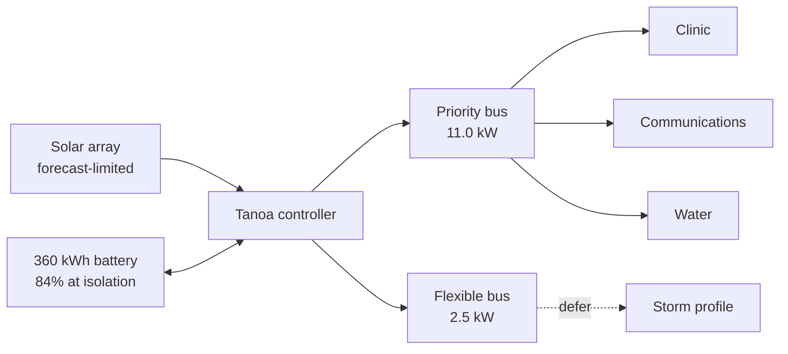
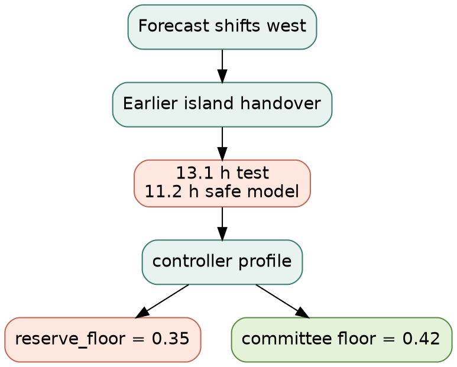

# Holding the island through the storm

*Fulaga Community Energy Committee · Project Tanoa · Commissioning Watch*

> [!IMPORTANT]
> **14 minutes to the isolation decision.** A westward shift in the forecast has moved the safe handover ahead of the field plan. The committee must decide what the microgrid will carry before crews shelter.

**Project Tanoa is a fictional 2032 design scenario.** Its storm, equipment, telemetry, committee, loads, and outcome do not describe present conditions on Fulaga. The island outline below is sourced; the forecast track is fictional.

```svg
<svg xmlns="http://www.w3.org/2000/svg" viewBox="0 0 1000 520" role="img" aria-labelledby="fulaga-title fulaga-desc" data-osm-relation="3521053">
  <title id="fulaga-title">Fulaga, Lau Group — fictional Project Tanoa commissioning watch</title>
  <desc id="fulaga-desc">The sourced outline of Fulaga with a fictional cyclone forecast track approaching from the east.</desc>
  <rect width="1000" height="520" rx="28" fill="#0b2f38"/>
  <path d="M0 82 H1000 M0 164 H1000 M0 246 H1000 M0 328 H1000 M0 410 H1000" fill="none" stroke="#d8eee6" stroke-opacity="0.08"/>
  <path d="M128 0 V520 M256 0 V520 M384 0 V520 M512 0 V520 M640 0 V520 M768 0 V520 M896 0 V520" fill="none" stroke="#d8eee6" stroke-opacity="0.06"/>
  <text x="54" y="66" fill="#f8edda" font-family="ui-serif, Georgia, serif" font-size="30" letter-spacing="3">FULAGA / LAU GROUP</text>
  <text x="56" y="94" fill="#8fcbbc" font-family="ui-sans-serif, system-ui, sans-serif" font-size="14" letter-spacing="2">PROJECT TANOA · FICTIONAL 2032 SCENARIO</text>
  <g transform="translate(58 74) scale(.72)">
    <path d="M 40.0 254.8 L 56.1 290.2 L 60.6 343.8 L 89.0 364.9 L 125.2 376.6 L 168.2 380.8 L 302.0 352.8 L 481.1 340.8 L 527.6 358.8 L 540.5 355.0 L 549.5 360.4 L 539.7 365.2 L 540.3 369.4 L 520.2 376.6 L 551.6 445.2 L 575.7 463.6 L 634.8 479.0 L 680.0 478.7 L 755.0 459.4 L 914.8 400.1 L 944.7 372.3 L 960.0 343.9 L 951.9 348.6 L 950.4 341.0 L 941.7 337.1 L 922.7 336.6 L 935.9 354.2 L 934.0 358.5 L 901.7 374.0 L 907.4 381.2 L 887.6 390.7 L 871.3 384.3 L 852.4 386.2 L 853.7 389.8 L 825.6 395.0 L 809.7 406.6 L 791.2 403.0 L 800.7 398.7 L 793.3 396.5 L 793.5 389.5 L 748.8 388.1 L 744.4 396.1 L 755.8 397.4 L 754.8 404.9 L 733.1 410.0 L 729.2 408.7 L 731.1 398.3 L 700.1 401.2 L 691.7 384.5 L 696.4 378.5 L 689.7 366.8 L 679.9 376.1 L 678.7 369.8 L 669.6 369.5 L 657.9 382.2 L 653.3 377.5 L 629.2 376.8 L 609.6 366.9 L 616.8 351.1 L 593.2 350.6 L 577.6 342.1 L 558.1 340.1 L 554.7 336.1 L 558.2 325.8 L 584.5 324.9 L 576.8 319.2 L 591.5 310.0 L 574.7 306.8 L 569.1 298.8 L 524.1 302.3 L 518.1 299.1 L 521.8 295.6 L 495.8 296.8 L 482.6 290.3 L 450.6 289.7 L 441.9 284.3 L 411.6 288.2 L 412.0 284.9 L 392.6 279.5 L 312.8 273.3 L 289.8 261.3 L 305.5 275.8 L 304.5 280.6 L 274.6 295.2 L 270.2 303.2 L 259.3 304.7 L 230.5 291.9 L 219.1 278.4 L 222.5 273.9 L 172.9 253.9 L 167.8 235.7 L 175.2 226.9 L 171.7 212.1 L 193.3 208.1 L 213.3 211.9 L 226.3 194.9 L 209.2 185.7 L 209.0 181.2 L 227.1 152.6 L 249.8 141.0 L 259.9 128.8 L 276.5 122.2 L 296.2 121.6 L 316.0 109.9 L 355.7 104.9 L 392.2 87.4 L 438.3 80.9 L 459.4 91.3 L 457.6 100.1 L 510.5 109.2 L 517.2 127.8 L 526.9 130.2 L 542.1 146.1 L 548.6 146.1 L 555.0 138.9 L 552.2 134.4 L 557.0 133.7 L 560.3 120.1 L 585.8 115.6 L 631.6 118.0 L 555.8 101.8 L 544.3 91.1 L 555.7 82.3 L 546.9 71.1 L 532.5 66.3 L 528.9 66.3 L 534.3 69.6 L 529.9 74.9 L 507.3 66.4 L 459.3 68.7 L 409.3 64.0 L 370.7 47.5 L 339.5 43.4 L 352.0 41.6 L 347.2 40.0 L 299.1 45.6 L 275.0 58.4 L 238.3 99.6 L 244.0 102.3 L 214.8 121.7 L 223.3 132.9 L 182.0 141.6 L 173.0 136.1 L 150.3 147.3 L 137.9 161.4 L 71.3 204.6 L 40.0 254.8 Z" fill="#bce1d5" fill-opacity="0.88" stroke="#faefd9" stroke-width="5" stroke-linejoin="round"/>
    <path d="M235 215 C330 152 458 147 571 198 C494 236 374 253 275 249 Z" fill="#2d9b91" fill-opacity="0.72"/>
    <circle cx="420" cy="204" r="9" fill="#f7e8cb"/>
    <circle cx="420" cy="204" r="18" fill="none" stroke="#f7e8cb" stroke-opacity="0.45"/>
  </g>
  <g fill="none" stroke="#f08d78" stroke-width="4" stroke-linecap="round">
    <path d="M946 122 C884 138 839 163 795 196 C760 222 733 245 706 275" stroke-dasharray="3 12"/>
    <circle cx="946" cy="122" r="8" fill="#f08d78"/>
    <circle cx="856" cy="153" r="7" fill="#f08d78"/>
    <circle cx="785" cy="203" r="6" fill="#f08d78"/>
  </g>
  <text x="744" y="102" fill="#ffb09d" font-family="ui-sans-serif, system-ui, sans-serif" font-size="14" letter-spacing="1.5">FICTIONAL FORECAST TRACK</text>
  <g transform="translate(748 314)">
    <rect width="202" height="116" rx="18" fill="#f8edda"/>
    <text x="20" y="34" fill="#6d342d" font-family="ui-sans-serif, system-ui, sans-serif" font-size="12" font-weight="700" letter-spacing="1.4">DECISION WINDOW</text>
    <text x="18" y="84" fill="#0b2f38" font-family="ui-serif, Georgia, serif" font-size="50">14 min</text>
  </g>
  <text x="54" y="494" fill="#b9d8cf" font-family="ui-sans-serif, system-ui, sans-serif" font-size="11">Map data © OpenStreetMap contributors · ODbL 1.0 · https://www.openstreetmap.org/copyright</text>
</svg>
```

The name **Tanoa** refers to the wooden bowl used to prepare and share yaqona: a shared vessel, used here as a metaphor for energy held for the whole community—not as decoration. “Fulaga” remains the working public form pending Fijian-language or Fulaga community language review.

*Map source: [standalone SVG](assets/fulaga-map.svg) · [OpenStreetMap relation 3521053](https://www.openstreetmap.org/relation/3521053) · [ODbL attribution](https://www.openstreetmap.org/copyright).*

[simplemark-showcase-paste]: <simplemark:paste>

## Commissioning watch

At T−72 hours, the system was ready for a daylight handover. At T−24, the forecast moved west and erased that assumption. The equipment is behaving; the plan is no longer safe.

> [!WARNING]
> **The test passed against the wrong promise.** The controller counted energy down to a 35% reserve floor. The community-approved floor is 42%. On the safe model, usable autonomy is **11.2 hours** against **13.0 hours required**.

### What the committee agreed to protect

- [x] Clinic circuit remains energised
- [x] Communications circuit remains energised
- [x] Water circuit remains energised
- [ ] Flexible 2.5 kW commissioning load remains online
- [ ] Island mode begins before crews shelter

The fourth item is optional. The first three are not.

### How energy moves



### The forecast changed the arithmetic

The reserve projection below is deliberately conservative: forecast solar is shown, but it is not credited to the safe-autonomy calculation during the storm window. The two reserve lines differ only by the 2.5 kW flexible load.

```vega-lite
{
  "$schema": "https://vega.github.io/schema/vega-lite/v6.json",
  "background": null,
  "data": {
    "values": [
      {"hour": 0, "series": "Commissioning plan", "reserve": 84, "generation": 4.8},
      {"hour": 3, "series": "Commissioning plan", "reserve": 72.8, "generation": 3.6},
      {"hour": 6, "series": "Commissioning plan", "reserve": 61.5, "generation": 2.2},
      {"hour": 9, "series": "Commissioning plan", "reserve": 50.3, "generation": 0.9},
      {"hour": 11.2, "series": "Commissioning plan", "reserve": 42, "generation": 0.3},
      {"hour": 13, "series": "Commissioning plan", "reserve": 35.3, "generation": 0.1},
      {"hour": 0, "series": "Priority plan", "reserve": 84, "generation": 4.8},
      {"hour": 3, "series": "Priority plan", "reserve": 74.8, "generation": 3.6},
      {"hour": 6, "series": "Priority plan", "reserve": 65.7, "generation": 2.2},
      {"hour": 9, "series": "Priority plan", "reserve": 56.5, "generation": 0.9},
      {"hour": 11.2, "series": "Priority plan", "reserve": 49.8, "generation": 0.3},
      {"hour": 13, "series": "Priority plan", "reserve": 44.3, "generation": 0.1}
    ]
  },
  "vconcat": [
    {
      "width": 640,
      "height": 210,
      "layer": [
        {
          "mark": {"type": "line", "strokeWidth": 4, "point": {"filled": true, "size": 60}},
          "encoding": {
            "x": {"field": "hour", "type": "quantitative", "title": "Hours in island mode"},
            "y": {"field": "reserve", "type": "quantitative", "title": "Battery reserve (%)", "scale": {"domain": [30, 88]}},
            "color": {
              "field": "series",
              "type": "nominal",
              "scale": {"domain": ["Commissioning plan", "Priority plan"], "range": ["#e77f6d", "#338b7c"]},
              "title": null
            }
          }
        },
        {
          "mark": {"type": "rule", "strokeDash": [8, 6], "color": "#d9a441", "strokeWidth": 2},
          "encoding": {"y": {"datum": 42}}
        },
        {
          "mark": {"type": "text", "align": "right", "dx": -8, "dy": -8, "color": "#a56b12", "fontWeight": "bold"},
          "encoding": {"x": {"datum": 13}, "y": {"datum": 42}, "text": {"value": "community floor · 42%"}}
        }
      ]
    },
    {
      "width": 640,
      "height": 72,
      "transform": [{"filter": "datum.series === 'Priority plan'"}],
      "mark": {"type": "bar", "cornerRadiusTopLeft": 4, "cornerRadiusTopRight": 4, "color": "#75b8aa"},
      "encoding": {
        "x": {"field": "hour", "type": "quantitative", "title": "Forecast interval"},
        "y": {"field": "generation", "type": "quantitative", "title": "PV kW"}
      }
    }
  ],
  "config": {"view": {"stroke": null}, "axis": {"gridColor": "#d8dedb", "labelColor": "#40514d", "titleColor": "#40514d"}}
}
```

| Signal | Commissioning profile | Community floor | Finding |
| --- | ---: | ---: | --- |
| Battery at isolation | 84% | — | ready |
| Controller reserve floor | **35%** | **42%** | stale profile |
| Safe autonomy | **11.2 h** | **13.0 h** | **1.8 h short** |
| Priority circuits | 3/3 | 3/3 | hold all |
| Flexible load | 2.5 kW | deferrable | decision available |

### The safe model

With storm-window solar excluded, usable battery energy above the approved floor is:

$$
E_{safe}=360\,\mathrm{kWh}\,(0.84-0.42)=151.2\,\mathrm{kWh}
$$

At the 13.5 kW commissioning load:

$$
t_{before}=\frac{151.2\,\mathrm{kWh}}{13.5\,\mathrm{kW}}=11.2\,\mathrm{h}
\qquad
\Delta t=13.0-11.2=1.8\,\mathrm{h}
$$

At the 11.0 kW priority load:

$$
t_{accepted}=\frac{151.2\,\mathrm{kWh}}{11.0\,\mathrm{kW}}=13.7\,\mathrm{h}
$$

The decision is not to spend the reserve. It is to stop asking the reserve to carry optional work.

### Why the earlier test passed

```ansi
TANOA COMMISSIONING · CYCLONE-EARLY-ISLAND
─────────────────────────────────────────
✓ battery link ............... 360 kWh · 84%
✓ priority circuits .......... 3 / 3 ready
✓ inverter synchronisation ... 50.0 Hz
✗ reserve_floor .............. 0.35 · expected 0.42
! controller estimate ........ 13.1 h · FALSE PASS
! safe-model estimate ........ 11.2 h · SHORT BY 1.8 h
```

The battery did not fail. A stale commissioning profile asked the right hardware the wrong question.



## Committee decision

| Option | Clinic · Comms · Water | Safe autonomy | Reserve rule | Decision |
| --- | --- | ---: | --- | --- |
| Continue commissioning load | 3/3 | 11.2 h | honour 42% | reject — 1.8 h short |
| Spend below the floor | 3/3 | 13.1 h apparent | break 42% | reject — passes by consuming the promise |
| **Defer 2.5 kW flexible load** | **3/3** | **13.7 h** | **honour 42%** | **accept** |

> [!NOTE]
> **Accepted:** protect clinic, communications, and water; defer the flexible commissioning load; restore the approved reserve floor; enter island mode after the check passes.

### The exact correction

This is the only operational source changed during the decision.

```json
{
  "profile": "cyclone-early-island",
  "battery_capacity_kwh": 360,
  "priority_load_kw": 11,
  "flexible_load_kw": 0,
  "priority_circuits": ["clinic", "communications", "water"],
  "reserve_floor": 0.42
}
```

[simplemark-showcase-final]: <simplemark:final>

## Island mode confirmed

> [!TIP]
> **The island is holding.** The final commissioning update records the completed handover: 50.0 Hz, 78% reserve, and all three priority circuits holding. No priority circuit was dropped.

| Final check | Result | State |
| --- | ---: | --- |
| Grid-forming frequency | **50.0 Hz** | stable |
| Battery reserve at transition | **78%** | above 42% floor |
| Priority circuits holding | **3/3** | clinic · communications · water |
| Safe autonomy | **13.7 h** | 0.7 h above requirement |

- [x] Flexible load deferred
- [x] `reserve_floor` restored to `0.42`
- [x] Island-mode check passed
- [x] Field crews released to shelter

The final green state does not erase the warning. It records what changed, what stayed protected, and why the committee could sign the handover.

---

## Engineering appendix

### Scenario data dictionary

| Field | Meaning | Unit | Source in this scenario |
| --- | --- | --- | --- |
| `capacityKwh` | installed battery nameplate | kWh | fictional fixture |
| `isolationSoc` | state of charge at planned isolation | fraction | fictional fixture |
| `approvedReserveFloor` | community-approved minimum reserve | fraction | fictional decision |
| `commissioningKw` | priority plus flexible commissioning demand | kW | fictional fixture |
| `priorityKw` | clinic, communications, and water aggregate | kW | fictional fixture |
| `safeBeforeHours` | autonomy above the approved floor at 13.5 kW | h | calculated |
| `acceptedHours` | autonomy above the approved floor at 11.0 kW | h | calculated |

The chart's solar forecast is displayed for operational context but excluded from the safe-autonomy calculation. Rounding is to one decimal place; the JSON scenario remains the governing fixture.

### Audit trail

```text
T−72 h  daylight handover ready
T−24 h  forecast shifts west
T−18 h  safe model reveals 1.8 h gap
T−14 m  committee accepts priority profile
T−09 m  reserve floor corrected to 0.42
T+00 m  island mode stable at 50.0 Hz
```

### Sources and review boundary

- Geography: [OpenStreetMap relation 3521053](https://www.openstreetmap.org/relation/3521053), used under the [Open Database Licence](https://www.openstreetmap.org/copyright). Map data © OpenStreetMap contributors.
- Place context: [Fiji Parliament review of shipping services for the Lau Group](https://www.parliament.gov.fj/wp-content/uploads/2020/09/Review-Report-on-the-Petition-for-Government-to-Provide-Reliable-Safe-and-Affordable-Shipping-Services-for-the-Lau-Group.pdf).
- Energy-system context: [UNDP Pacific on Fiji maritime-island solar mini-grids, storage, meters, and remote monitoring](https://www.undp.org/pacific/stories/illuminating-maritime-islands-fiji-fiji-rural-electrification-fund-fref-rollout).
- Name context: [Fiji Government usage of “tanoa of yaqona”](https://www.fiji.gov.fj/Media-Centre/Speeches/English/PRIME-MINISTER-HON-VOREQE-BAINIMARAMA-S-SPEEC-%2821%29).

No source above supports the fictional cyclone, equipment, loads, committee decision, or outcome. Public publication remains **pending Fijian-language or Fulaga community language review**; this document must not imply community endorsement before that review occurs.
