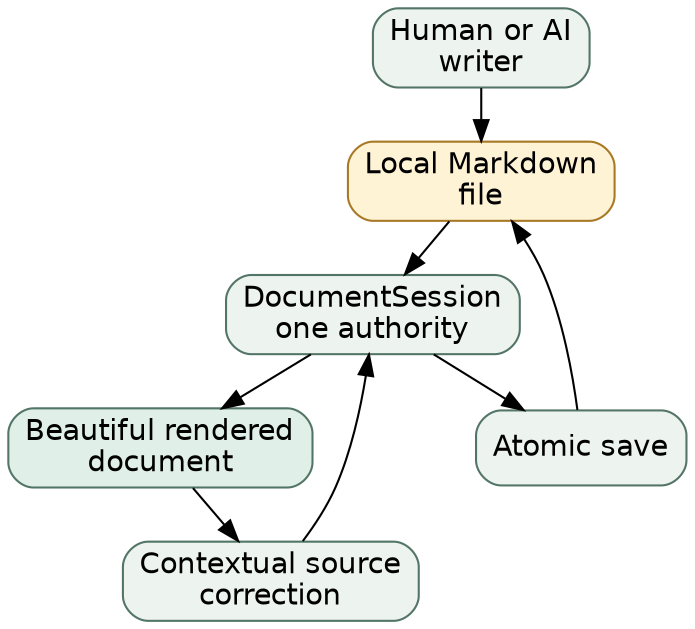

# SimpleMark 1.0

*Founder and launch-team plan for the beautiful living document for AI work*

> [!IMPORTANT]
> **Planning document — not a shipped-product claim.** SimpleMark is pre-alpha. Current evidence is linked; gates and targets describe the conditions for a future 1.0 decision.

## Launch decision

**Decision under review:** earn the right to call SimpleMark 1.0 by making one experience exceptional:

> Open Markdown written by any AI, read it as a beautiful living document, watch it change without losing your place, and correct the exact source block only when needed.

> **Decision**
> Ship the document, not the machinery. The default surface stays rendered, local, calm, and file-first. Chat, agent controls, collaboration, provider setup, and permanent source panes do not enter the 1.0 install reason.

The launch is a **go** only when the release candidate proves the experience end to end on real files. A date does not overrule the evidence.

| At a glance | State | Owner | Next proof |
| --- | --- | --- | --- |
| Product promise | decided | Founder | hold the boundary through release review |
| Rendered document | proven in current composition | Product | flagship and hostile-file review |
| Source fidelity | proven by automated fixtures | Engineering | zero known byte-loss regressions in RC |
| Native distribution | at risk | Release | signed, notarized, installable artifacts |
| Public story | in progress | Founder | website, download path, launch copy |
| Project Tanoa flagship | internal preview | Product | community language review before public use |

## Current truth and the 1.0 bar

> **Current evidence**
> The current product contract is rendered-document-first, local-file-first, and correction-not-authoring. See [PRODUCT.md](../PRODUCT.md), the [repository status](../../README.md#status), and [ADR-0005](../decisions/0005-rendered-document-before-agent-participation.md).

| Surface | Current truth | 1.0 bar | Owner | Exit evidence |
| --- | --- | --- | --- | --- |
| Markdown reading | one continuous rendered page | ten representative AI documents judged publication-ready | Product | signed visual review sheet |
| Technical material | Mermaid, SVG, math, DOT, Vega-Lite, ANSI, JSON, code, tables | no silent blank renderer; portable fallback for every block | Engineering | renderer matrix and failure screenshots |
| Source fidelity | untouched blocks retain original bytes | zero known byte-loss regressions | Engineering | hostile-fixture suite at release SHA |
| Contextual editing | source opens for the selected rendered block | correction, undo, save, reopen all preserve unrelated bytes | Engineering | exact-file browser and native checks |
| Local files | browser and native ports share application authority | open, save, rename, and relative assets work on supported platforms | Engineering | platform smoke receipts |
| External writes | native watcher reports changes from disk | calm refresh behavior is understandable and never implies attribution | Product | one-day dogfood log and watched-file film |
| macOS app | Tauri bundle can be built locally | signed and notarized artifact installs cleanly | Release | release-trust receipt |
| Other platforms | build paths exist | either supported with evidence or omitted from 1.0 promise | Founder | explicit platform decision |
| Accessibility | semantic controls exist | keyboard and screen-reader critical path passes | Product | recorded accessibility audit |
| Website | positioning and prototype GIF exist | truthful download, trust, support, and privacy path | Founder | production URL review |
| Support | repository guidance exists | owner, response promise, known-issues path, rollback plan | Founder | published support page |
| Flagship story | Project Tanoa renders as an internal preview | language and community framing approved before public use | Product | reviewer, date, and outcome recorded |

> **1.0 gate**
> Distribution is not ready merely because a `.app` can be built. **Exit evidence:** signed and notarized release-candidate artifacts, update-path proof, clean-machine install, rollback rehearsal, and provenance tied to the release SHA. **Owner:** Release.

## The defining experience

The launch demo should take less than a minute to understand:

1. An agent has already written `plan.md`.
2. SimpleMark opens that exact local file as a finished document.
3. Diagrams, math, charts, terminal output, code, tables, and callouts belong to one reading surface.
4. One rendered block reveals its source; a small correction re-renders in place.
5. Save leaves an ordinary Markdown file where it started.

The product earns trust through restraint. It should feel closer to opening a great PDF than entering another workspace—except the document is alive and correctable.

> [!NOTE]
> The flagship is [Project Tanoa](project-tanoa.md): a fictional Fulaga microgrid commissioning decision told through a sourced map, live reserve forecast, battery math, terminal evidence, a fault tree, configuration, and a final handover.

> **Current evidence**
> The exact Project Tanoa source is opened by the current browser file port, renders its current technical blocks, survives an untouched save byte-for-byte, and persists the contextual JSON correction. The executable checks live beside the [field report](project-tanoa.md).

## Category and positioning

**Category:** the beautiful living document for AI work.

**Primary user:** someone who asks an AI to produce a plan, report, specification, runbook, analysis, or field note—and then needs a better place to read and judge it.

**Primary object:** the document.

| We are | We are not |
| --- | --- |
| a beautiful reader for local AI-generated Markdown | an AI workspace or agent cockpit |
| a calm surface for documents that keep changing | a chat client with a preview attached |
| contextual correction inside the rendered page | a permanent source-and-preview editor |
| ordinary files under the user's control | a proprietary document store |
| technical rendering with portable fallbacks | a screenshot generator that loses the source |

> **Decision**
> “Always rendered, always your file” is the product test. A feature that weakens either half waits.

## Product and release architecture

The loop is intentionally small: writers change a file; one document authority accepts changes; the reader renders the result; corrections return through the same authority.



> **Current evidence**
> Module direction is enforced as `app → adapters → application → domain`; `DocumentSession` owns the open document above filesystem and editor adapters. See [the contributor guide](../../the contributor guide), [document-session.ts](../../src/application/document-session.ts), and [the canonical gate](../../scripts/simplemark_ci.sh).

A filesystem watcher can report that bytes changed. It cannot truthfully name the writer, infer a shared cloud root, or claim an automatic merge. Those are separate capabilities and separate evidence.

## Launch readiness

| Readiness area | State | What is real now | What blocks 1.0 |
| --- | --- | --- | --- |
| Product boundary | **Proven** | current contract and accepted ADR | nothing; defend it |
| Renderer breadth | **Proven** | current composite renderer set | visual/failure matrix at RC |
| Byte fidelity | **Proven** | source-map and round-trip tests | zero open severity-1 fidelity defects |
| Flagship document | **At risk** | internal Project Tanoa preview | community language review |
| Everyday-work proof | **In progress** | this launch plan | exact-file visual review |
| Native release trust | **Blocked** | build configuration exists | signing, notarization, clean install, rollback |
| Cross-platform promise | **Not started** | test-build intent exists | decide scope from evidence |
| Public download path | **At risk** | product language exists | truthful live site and support path |

> [!WARNING]
> The launch can slip. The product boundary cannot. Removing proof to preserve a date is a **hold**, not a smaller launch.

## Success measures

These are future release-candidate targets, not current results.

> **Target**
> **First-file success:** at least 9 of 10 recruited AI-Markdown readers open a local file and reach a rendered document without help. **Owner:** Product. **Window:** two-week RC study.

> **Target**
> **Time to first document:** median under 20 seconds from launch to readable local file, excluding OS picker time. **Owner:** Engineering. **Window:** two-week RC telemetry study with explicit consent.

> **Target**
> **Fidelity:** zero known unrelated-byte changes after a one-block correction across the release fixture corpus. **Owner:** Engineering. **Window:** every RC build.

> **Target**
> **Renderer reliability:** fewer than 0.5% visible renderer error cards across the curated RC corpus, with no silent blanks. **Owner:** Product. **Window:** fourteen days before go/no-go.

> **Target**
> **Native stability:** at least 99.5% crash-free document sessions in the invited RC cohort. **Owner:** Release. **Window:** fourteen-day RC.

> **Target**
> **Download-to-open:** establish a measured baseline; do not set a conversion promise until the download, install, and first-file funnel is observable. **Owner:** Founder. **Window:** first thirty days after a go decision.

The machine-readable go/no-go envelope:

```json
{
  "decision": "go | hold",
  "known_byte_loss_regressions": 0,
  "silent_renderer_failures": 0,
  "clean_install": "required",
  "signed_and_notarized": "required",
  "critical_accessibility_path": "required",
  "flagship_language_review": "required before public use"
}
```

## Risks and decisions

| Risk | State | Owner | Exit evidence | Decision date |
| --- | --- | --- | --- | --- |
| unrelated Markdown bytes change | open until RC | Engineering | exact fixture corpus at release SHA | go/no-go |
| a renderer fails silently | open until RC | Engineering | failure matrix shows fallback or visible error | go/no-go |
| signing or notarization fails | blocked | Release | clean-machine install from published artifact | go/no-go |
| website promises planned behavior | active | Founder | line-by-line claim audit against release | copy freeze |
| keyboard or screen-reader path breaks | unproven | Product | critical-path accessibility report | RC−7 days |
| external changes imply merge or attribution | active | Product | copy and demo review | demo freeze |
| Fulaga framing lacks community review | gated | Product | reviewer, date, result | before public flagship use |

> **Decision**
> When evidence conflicts with launch copy, change the copy. When evidence conflicts with the product promise, hold the launch.

## Six-week launch sequence

### Week 1 — freeze the promise

- [ ] Founder: approve category, audience, promise, and explicit refusals
- [ ] Product: lock the representative-document corpus
- [ ] Engineering: close or classify every fidelity defect

### Week 2 — prove the document

- [ ] Product: review Project Tanoa and the launch brief at publication width
- [ ] Engineering: run renderer failure and fallback matrix
- [ ] Product: conduct the critical accessibility path

### Week 3 — prove the app

- [ ] Release: produce signed and notarized candidate artifacts
- [ ] Release: install on clean supported machines
- [ ] Engineering: rehearse update and rollback paths

### Week 4 — prove the story

- [ ] Founder: finish the website and download path
- [ ] Product: complete community language review before public Tanoa use
- [ ] Founder: audit every claim against the candidate SHA

### Week 5 — invited release candidate

- [ ] Product: run the first-file study with ten representative readers
- [ ] Engineering: monitor renderer, fidelity, and crash evidence
- [ ] Founder: prepare support, known issues, and response ownership

### Week 6 — decide

- [ ] Release: freeze the evidence packet
- [ ] Founder: chair go/no-go with Product, Engineering, and Release
- [ ] Team: publish only on **go**; otherwise name the failed gate and next review date

## Release proof

Commands to run at the release-candidate SHA:

```bash
bash scripts/simplemark_ci.sh
npm run test:native
npm run build:native
```

> **1.0 gate**
> A green local command is necessary, not sufficient. **Exit evidence:** canonical CI at the exact release SHA, platform smoke receipts, release-trust receipt, signed artifact hashes, and clean-install results. **Owner:** Release.

The public package should stay legible:

```tree
simplemark-1.0/
├── SimpleMark.app
├── SHA256SUMS
├── RELEASE_NOTES.md
├── KNOWN_ISSUES.md
├── PRIVACY.md
└── provenance/
    ├── build.json
    └── platform-smoke.json
```

The repository already defines the intended proof boundary in the [release contract](../RELEASE-CONTRACT.md). The 1.0 packet must contain evidence, not a screenshot of a green badge.

## Launch language

### Headline

**Your agent writes the Markdown. SimpleMark turns it into a document.**

### Short description

SimpleMark opens local Markdown as a beautiful living document. Read diagrams, math, charts, tables, code, and technical output on one calm page; reveal source only for the block you need to correct; keep the ordinary file exactly where it belongs.

### Announcement draft

AI can already write the report. The missing piece is a place you actually want to read it. SimpleMark turns local Markdown into a finished document—always rendered, always your file.

### Language to avoid

| Avoid | Why | Say instead |
| --- | --- | --- |
| “AI workspace” | changes the category | “living document for AI work” |
| “collaborative editor” | not the first install reason | “local document with contextual correction” |
| “automatic merge” | overstates external-file behavior | “reports an external change” |
| “attributes every writer” | disk bytes do not provide identity | “keeps provenance only when the source provides it” |
| “works everywhere” | platform proof is not complete | name only verified platforms |
| “lossless editing” without scope | hides the actual contract | “untouched blocks preserve their original bytes” |

## Evidence notes

- **Current evidence** means a present claim linked to implementation, an accepted decision, or an executable check.
- **1.0 gate** means a required condition with named exit evidence and owner.
- **Target** means a future measurement with an owner and window; it is not a baseline.
- **Decision** means a product or launch choice the team intends to defend.

Evidence snapshot: **8 August 2026**. The exact release SHA is intentionally blank until go/no-go.

Primary sources: [product contract](../PRODUCT.md) · [repository status](../../README.md) · [renderer contract](../RENDERERS.md) · [release contract](../RELEASE-CONTRACT.md) · [rendered-document-first decision](../decisions/0005-rendered-document-before-agent-participation.md) · [one authoritative change stream](../decisions/0006-one-authoritative-change-stream.md) · [Project Tanoa](project-tanoa.md).
