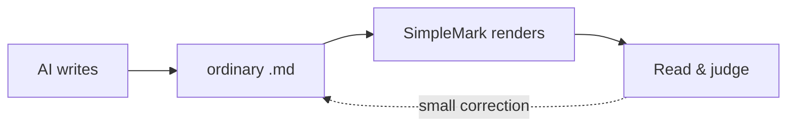
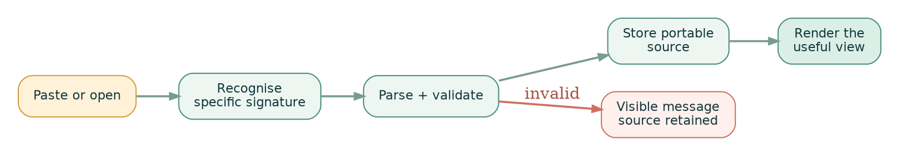

# Welcome to SimpleMark

*This document is the demo.*

> [!IMPORTANT]
> **Open ordinary Markdown. Read the finished document. Reveal source only for the exact block you want to change.**

SimpleMark is where AI-written Markdown becomes something you can actually read, judge, and keep.
There is no import ritual and no proprietary copy hiding behind the page. The durable result is the
same portable text file you started with.[^portable]

| In one minute | What to do | What you should notice |
| --- | --- | --- |
| **Read** | scroll this page | typography, diagrams, data, and evidence share one calm canvas |
| **Inspect** | hover over a technical block | **Edit source** appears only where it is useful |
| **Correct** | change one small value | the rendered result updates in place |
| **Keep** | open your own `.md` | SimpleMark leaves an ordinary Markdown file behind |

```svg
<svg viewBox="0 0 920 360" xmlns="http://www.w3.org/2000/svg" role="img" aria-label="Portable Markdown becoming a living SimpleMark document">
  <defs>
    <linearGradient id="paper" x1="0" y1="0" x2="1" y2="1">
      <stop offset="0" stop-color="#fffaf1"/>
      <stop offset="1" stop-color="#edf6f1"/>
    </linearGradient>
    <linearGradient id="flow" x1="0" y1="0" x2="1" y2="0">
      <stop offset="0" stop-color="#ffb15c"/>
      <stop offset="1" stop-color="#4d8f7e"/>
    </linearGradient>
    <filter id="shadow" x="-20%" y="-20%" width="140%" height="140%">
      <feDropShadow dx="0" dy="10" stdDeviation="14" flood-color="#173a3f" flood-opacity=".14"/>
    </filter>
  </defs>
  <rect x="8" y="8" width="904" height="344" rx="30" fill="url(#paper)"/>
  <circle cx="76" cy="66" r="13" fill="#ff7a66"/>
  <text x="102" y="73" font-family="Inter,system-ui,sans-serif" font-size="17" font-weight="700" fill="#173a3f">ORDINARY SOURCE</text>
  <g filter="url(#shadow)">
    <rect x="52" y="102" width="306" height="196" rx="18" fill="#fffdf8" stroke="#d7dfda"/>
  </g>
  <text x="78" y="139" font-family="ui-monospace,SFMono-Regular,monospace" font-size="15" fill="#a35643"># Launch decision</text>
  <text x="78" y="171" font-family="ui-monospace,SFMono-Regular,monospace" font-size="14" fill="#5c6f69">The evidence says **go**.</text>
  <text x="78" y="205" font-family="ui-monospace,SFMono-Regular,monospace" font-size="14" fill="#5c6f69">| Signal | Result |</text>
  <text x="78" y="231" font-family="ui-monospace,SFMono-Regular,monospace" font-size="14" fill="#5c6f69">| Tests  | 42/42  |</text>
  <text x="78" y="264" font-family="ui-monospace,SFMono-Regular,monospace" font-size="14" fill="#4d8f7e">flowchart LR · A --&gt; B</text>
  <path d="M390 198 H480" stroke="url(#flow)" stroke-width="8" stroke-linecap="round"/>
  <path d="M466 180 L490 198 L466 216" fill="none" stroke="#4d8f7e" stroke-width="8" stroke-linecap="round" stroke-linejoin="round"/>
  <text x="397" y="167" font-family="Inter,system-ui,sans-serif" font-size="13" font-weight="700" fill="#6c7f78">SAME FILE</text>
  <g filter="url(#shadow)">
    <rect x="526" y="72" width="340" height="246" rx="22" fill="#fffdf8" stroke="#cddbd5"/>
  </g>
  <text x="556" y="115" font-family="Georgia,serif" font-size="27" font-weight="700" fill="#173a3f">Launch decision</text>
  <text x="556" y="148" font-family="Georgia,serif" font-size="16" fill="#435b54">The evidence says</text>
  <rect x="693" y="128" width="48" height="27" rx="14" fill="#dcefe7"/>
  <text x="706" y="147" font-family="Inter,system-ui,sans-serif" font-size="14" font-weight="800" fill="#326b5c">GO</text>
  <rect x="556" y="176" width="280" height="54" rx="12" fill="#f3f0e7"/>
  <text x="573" y="198" font-family="Inter,system-ui,sans-serif" font-size="12" font-weight="700" fill="#6d7a76">SIGNAL</text>
  <text x="759" y="198" font-family="Inter,system-ui,sans-serif" font-size="12" font-weight="700" fill="#6d7a76">RESULT</text>
  <text x="573" y="219" font-family="Inter,system-ui,sans-serif" font-size="15" fill="#173a3f">Tests</text>
  <text x="766" y="219" font-family="Inter,system-ui,sans-serif" font-size="15" font-weight="800" fill="#326b5c">42/42</text>
  <circle cx="582" cy="272" r="16" fill="#ffb15c"/>
  <circle cx="697" cy="272" r="16" fill="#7bb9aa"/>
  <circle cx="810" cy="272" r="16" fill="#4d8f7e"/>
  <path d="M602 272 H674 M717 272 H786" stroke="#b6c8c1" stroke-width="5" stroke-linecap="round"/>
  <text x="648" y="340" text-anchor="middle" font-family="Inter,system-ui,sans-serif" font-size="13" font-weight="700" fill="#4d615a">PORTABLE MARKDOWN · LIVING DOCUMENT</text>
</svg>
```

> [!TIP]
> **Try it — colour.** Hover over the illustration, choose **Edit source**, and replace
> `fill="#ff7a66"` with `fill="#5c7cfa"`. Close the source sheet and
> the coral signal becomes blue. Press **⌘Z** to put it back.

---

## Start here

SimpleMark is designed around one unusually simple loop:

1. **Open** a Markdown file written by Codex, Claude, another AI, or yourself.
2. **Read** the rendered document instead of its punctuation.
3. **Correct** the exact sentence, diagram, formula, or chart that needs attention.
4. **Save** the ordinary file where it already lives.

> The page is the product. Source is an escape hatch, not the furniture.

That rule keeps the interface calm even when the material is not. A single report can contain an
executive summary, an equation, a dependency graph, a terminal trace, and a decision table without
turning into an IDE.

### Two ways to begin

| You already have… | Do this |
| --- | --- |
| a complete Markdown document | choose **Open file** and select it |
| raw technical material on the clipboard | paste it at an empty line and let SimpleMark validate it |

> [!NOTE]
> These two default documents are **samples**. Change anything you like: sample edits reset when
> SimpleMark restarts. Opening your own file returns to the normal local-file workflow.

---

## Make ordinary Markdown beautiful

Markdown already carries more structure than most AI chat windows show. SimpleMark makes that
structure visible: **strong claims**, *quiet context*, ~~discarded options~~, <u>deliberate emphasis</u>,
links, quotes, lists, tables, code, footnotes, and math all belong to one continuous document.

### A decision can be readable and auditable

> [!IMPORTANT]
> **Decision:** keep the artifact local, keep the source portable, and make every failure visible.

- [x] The document opens rendered.
- [x] Technical blocks retain editable source.
- [x] A correction can be undone.
- [ ] Open one of your own AI-written reports.

| Question | Human answer | Evidence beneath it |
| --- | --- | --- |
| What changed? | one block, not the whole file | the rendered result and its source |
| Can I trust it? | inspect the claim without leaving the page | data, math, code, and diagnostics |
| Can I take it elsewhere? | yes | ordinary Markdown and readable fallbacks |

The same sentence can carry inline math—signal quality $$S/N$$—without mistaking a price such as
$100 for a formula. A footnote can hold the deeper contract without breaking the reading flow.[^fidelity]

$$
\mathcal{D}
=
\underbrace{P}_{\text{clear prose}}
+
\underbrace{V}_{\text{visual structure}}
+
\underbrace{E}_{\text{inspectable evidence}}
=
\boxed{3}
$$

> [!TIP]
> **Try it — math.** Edit the formula source and replace `\boxed{3}` with
> `\boxed{4}`. The typeset result refreshes immediately; the source remains portable
> LaTeX inside the Markdown file.

### Links stay links

Use an ordinary relative link when the destination is known:
[open Project Tanoa: Storm Atlas](project-tanoa-storm-atlas.md). Use a wiki-style link when the
name itself is the useful reference: [[Project Tanoa]]. Either way, SimpleMark keeps readable text
in the document instead of hiding the relationship in a database.

---

## Paste technical material like magic

Paste is where SimpleMark stops feeling like a conventional Markdown reader. Raw technical material
is recognised by a specific signature, parsed, validated, and stored in a portable form. If the
claim is uncertain or invalid, the paste stays ordinary text.

| Paste | Stored as | Rendered as |
| --- | --- | --- |
| Mermaid source | `mermaid` fence | flow, sequence, state, journey, or Sankey diagram |
| raw SVG | `svg` fence | sanitised vector illustration |
| Graphviz/DOT | `dot` fence | dense dependency or topology graph |
| Vega-Lite JSON | `vega-lite` fence | data-driven chart |
| display LaTeX | `$$…$$` | typeset equation |
| JSON object or array | `json` fence | collapsible tree |
| unified diff | `diff` fence | red/green review card |
| ANSI terminal capture | `ansi` fence | coloured terminal card |
| file tree | `tree` fence | monospace hierarchy |
| stack trace | `stacktrace` fence | folded diagnostic |
| spreadsheet cells | GFM table | real rows and columns |

### One file, one judgment loop



> [!TIP]
> **Try it — diagram.** Open the Mermaid source and replace `JUDGE["Read & judge"]`
> with `JUDGE["Read, judge & decide"]`. The final node changes without rebuilding
> the rest of the page.

### A strong document has more than words

The chart below is illustrative, but the data inside it is real text you can inspect and change.

```vega-lite
{
  "$schema": "https://vega.github.io/schema/vega-lite/v6.json",
  "description": "Illustrative anatomy of a strong AI document",
  "title": {
    "text": "A strong AI document has more than words",
    "subtitle": "Illustrative share of attention · hover the block to inspect its data",
    "anchor": "start"
  },
  "width": 560,
  "height": 350,
  "data": {
    "values": [
      {"category":"Prose","value":34},
      {"category":"Decisions","value":18},
      {"category":"Data","value":16},
      {"category":"Diagrams","value":14},
      {"category":"Evidence","value":18}
    ]
  },
  "transform": [
    {"calculate": "datum.category + ' · ' + datum.value + '%'", "as": "label"}
  ],
  "encoding": {
    "theta": {"field": "value", "type": "quantitative", "stack": true},
    "color": {
      "field": "category",
      "type": "nominal",
      "scale": {"range": ["#4d8f7e", "#ffb15c", "#7bb9aa", "#ef7f6d", "#315f65"]},
      "legend": null
    },
    "order": {"field": "value", "sort": "descending"}
  },
  "layer": [
    {
      "mark": {
        "type": "arc",
        "innerRadius": 88,
        "outerRadius": 145,
        "cornerRadius": 7,
        "padAngle": 0.02,
        "stroke": "#fffdf8",
        "strokeWidth": 3
      }
    },
    {
      "mark": {
        "type": "text",
        "radius": 180,
        "fontSize": 13,
        "fontWeight": 700
      },
      "encoding": {
        "text": {"field": "label"},
        "color": {"value": "#29443f"}
      }
    }
  ],
  "config": {
    "view": {"stroke": null},
    "background": "transparent"
  }
}
```

> [!TIP]
> **Try it — data.** In the chart source, replace
> `"category":"Evidence","value":18` with
> `"category":"Evidence","value":24`. The evidence arc grows because the
> declarative chart is redrawn from the edited data.

### What each paste becomes

```vega-lite
{
  "$schema": "https://vega.github.io/schema/vega-lite/v6.json",
  "description": "A sparse heatmap mapping pasted formats to SimpleMark outcomes",
  "title": {
    "text": "From raw paste to readable result",
    "subtitle": "Every coloured cell is a validated, portable conversion",
    "anchor": "start"
  },
  "width": 560,
  "height": 360,
  "data": {
    "values": [
      {"source":"Markdown","result":"Document","label":"render"},
      {"source":"Mermaid","result":"Diagram","label":"draw"},
      {"source":"SVG","result":"Diagram","label":"sanitise"},
      {"source":"DOT","result":"Diagram","label":"layout"},
      {"source":"Vega-Lite","result":"Chart","label":"plot"},
      {"source":"LaTeX","result":"Math","label":"typeset"},
      {"source":"JSON","result":"Card","label":"fold"},
      {"source":"Diff","result":"Card","label":"review"},
      {"source":"ANSI","result":"Card","label":"colour"},
      {"source":"Tree / trace","result":"Card","label":"inspect"},
      {"source":"TSV cells","result":"Table","label":"structure"}
    ]
  },
  "layer": [
    {
      "mark": {"type": "rect", "cornerRadius": 9, "height": 24},
      "encoding": {
        "x": {
          "field": "result",
          "type": "nominal",
          "sort": ["Document", "Diagram", "Chart", "Math", "Card", "Table"],
          "axis": {"title": null, "labelAngle": 0}
        },
        "y": {
          "field": "source",
          "type": "nominal",
          "sort": null,
          "axis": {"title": null}
        },
        "color": {
          "field": "result",
          "type": "nominal",
          "scale": {"range": ["#315f65", "#4d8f7e", "#ffb15c", "#ef7f6d", "#7bb9aa", "#8c7cae"]},
          "legend": null
        }
      }
    },
    {
      "mark": {"type": "text", "fontSize": 11, "fontWeight": 700, "color": "#fffdf8"},
      "encoding": {
        "x": {
          "field": "result",
          "type": "nominal",
          "sort": ["Document", "Diagram", "Chart", "Math", "Card", "Table"]
        },
        "y": {"field": "source", "type": "nominal", "sort": null},
        "text": {"field": "label"}
      }
    }
  ],
  "config": {
    "view": {"stroke": null},
    "axis": {"grid": false, "domain": false, "tickSize": 0, "labelPadding": 9},
    "background": "transparent"
  }
}
```

---

## Change the picture by changing the source

Rendered does not mean sealed. Every technical block carries a small **Edit source** affordance.
It opens only the source for that block, leaving the rest of the document where it is.

### The correction path



Nothing silently turns into a blank rectangle. Valid source renders. Invalid source keeps its words
and shows a local message you can act on.

> [!WARNING]
> **A renderer is a view, not a new file format.** If another Markdown reader does not know how
> to draw a fence, the diagram or chart source is still there to read, diff, and edit.

### Your four safe experiments

- [ ] Change the coral dot in the SVG hero to blue.
- [ ] Rename the final Mermaid node.
- [ ] Raise Evidence from 18 to 24 in the radial chart.
- [ ] Change the boxed 3 to a boxed 4 in the formula.

Each original and replacement is valid. Use **⌘Z** after any experiment, or leave the sample changed
and let it reset on restart.

---

## Understand the trust model

The best technical document answers two readers at once. The first wants the conclusion. The second
wants to inspect how the conclusion was reached. SimpleMark lets the evidence live directly beneath
the summary without forcing everyone to read it first.

### The same page can carry the exhaust

The following sample build is illustrative. Its point is the range of material, not the numbers.

```typescript
type RenderedBlock =
  | { kind: 'document'; markdown: string }
  | { kind: 'diagram'; source: string }
  | { kind: 'chart'; spec: Record<string, unknown> }
  | { kind: 'evidence'; text: string }

export function present(block: RenderedBlock): 'rendered' | 'visible-error' {
  return block.kind === 'document' || block.source !== '' ? 'rendered' : 'visible-error'
}
```

```ansi
SIMPLEMARK / ILLUSTRATIVE SAMPLE BUILD
────────────────────────────────────────────
✓ Markdown parsed ............... 1 ordinary file
✓ Visual renderers .............. 5/5 visible
✓ Technical cards ............... 5/5 readable
✓ Untouched save ................ exact bytes
  network requests ............... 0 required
  result ......................... READY TO READ
```

```diff
diff --git a/launch-plan.md b/launch-plan.md
index 8f42a11..31c0f5e 100644
--- a/launch-plan.md
+++ b/launch-plan.md
@@ -18,3 +18,3 @@
-Open the source view and inspect the Markdown.
+Open the rendered document and inspect source only when needed.
 Keep the file ordinary, local, and portable.
```

```json
{
  "document": "welcome-to-simplemark.md",
  "mode": "rendered",
  "illustrative": true,
  "portable": true,
  "required_network_requests": 0,
  "technical_blocks": {
    "visual": ["svg", "mermaid", "dot", "vega-lite", "math"],
    "evidence": ["code", "ansi", "diff", "json", "tree", "stacktrace"]
  }
}
```

```tree
simplemark-samples/
├── welcome-to-simplemark.md
└── project-tanoa-storm-atlas.md
```

```stacktrace
VisibleRendererError: illustrative failure stays beside its source
    at validateBlock (document.ts:42:7)
    at renderChangedBlock (document.ts:78:11)
    at preserveReadingPosition (reader.ts:19:3)
```

> [!NOTE]
> Terminal output, diffs, JSON, trees, and traces are inert document evidence. They do not execute,
> fetch, or gain authority merely because they look like developer tools.

### What always remains true

| When this happens | What you see | What stays true |
| --- | --- | --- |
| a renderer succeeds | the diagram, chart, formula, or card | its source remains in Markdown |
| a renderer rejects source | a visible local message | the source remains available |
| you correct one block | that rendered block updates | unrelated source is not normalised |
| you undo | the correction reverses | the file remains ordinary |
| a desktop tool changes the file | the native reader refreshes | disk bytes do not reveal the writer or imply a merge |

---

## Keep this page nearby

### Interaction card

| Intent | Fast path |
| --- | --- |
| Open a local document | **Open file** |
| Correct prose | click into the rendered sentence |
| Correct a diagram or chart | hover the block → **Edit source** |
| Undo a correction | **⌘Z** |
| Save | **⌘S** |
| Find inside the document | **⌘F** |
| Change reader text size | **⌘+** / **⌘−** |
| Return to actual size | **⌘0** |
| Jump through the document | **Table of Contents** |
| Inspect words and reading time | **Statistics** |
| Print or export PDF | **Print** |

### Document capability map

| Capability | Source that stays portable | What SimpleMark adds |
| --- | --- | --- |
| headings, prose, lists, quotes | ordinary Markdown | publication-quality reading rhythm |
| tables and checklists | GFM | structured rows, cells, and tasks |
| links, wiki links, footnotes | readable text references | navigation without a proprietary graph |
| inline and display math | explicit double-dollar math | KaTeX typesetting |
| highlighted code | language fence | readable syntax colour |
| Mermaid | `mermaid` fence | friendly flows, journeys, states, and Sankey diagrams |
| SVG | `svg` fence | sanitised vector output |
| Graphviz | `dot` fence | dense directed layout |
| Vega-Lite | inline JSON spec | data-driven SVG charts |
| ANSI, diff, JSON, tree, trace | explicit technical fence | purpose-built evidence cards |
| raw spreadsheet cells | GFM table after paste | structured conversion instead of a screenshot |

### Web and macOS, honestly

| Capability | Web | macOS | What remains portable |
| --- | --- | --- | --- |
| Open a local `.md` | browser file picker | native picker or file association | the same Markdown file |
| Save | in place where the browser retains a file handle; otherwise a downloaded replacement | atomic in-place save | ordinary Markdown |
| Default samples | session-local; reset on restart | session-local; reset on restart | canonical samples remain `.md` |
| Reader appearance, zoom, find, contents, and statistics | available | available | presentation state never enters Markdown |
| Print or PDF | browser print panel | native print panel | platform print/PDF output |
| Recent notes and adopted folders | sample-session catalogue only | persistent local recent/folder catalogue | files stay in their original folders |
| Refresh after an external file write | unavailable as a desktop-style watcher | native filesystem watcher | the external bytes remain the source |

> [!IMPORTANT]
> A filesystem watcher can report that bytes changed. It cannot identify the writer, infer a shared
> cloud workspace, or promise an automatic merge. SimpleMark says only what the source can prove.

### Where to go next

- [x] Read the Living Handbook.
- [ ] Try one source correction and undo it.
- [ ] Open [Project Tanoa: Storm Atlas](project-tanoa-storm-atlas.md) for the cinematic field report.
- [ ] Open an AI-generated plan, report, runbook, or specification of your own.
- [ ] Paste a diagram, chart, diff, JSON object, or spreadsheet selection at an empty line.
- [ ] Close SimpleMark and confirm the file is still ordinary Markdown.

---

**Your agent writes the Markdown. SimpleMark turns it into a document.**

[^portable]: Portable means the durable content remains readable Markdown and text-based renderer
    source. A plain reader may show a fence instead of drawing it, but the claim and its data remain
    inspectable.

[^fidelity]: SimpleMark preserves the original bytes of untouched blocks. Correcting one block does
    not grant permission to reformat unrelated source.
