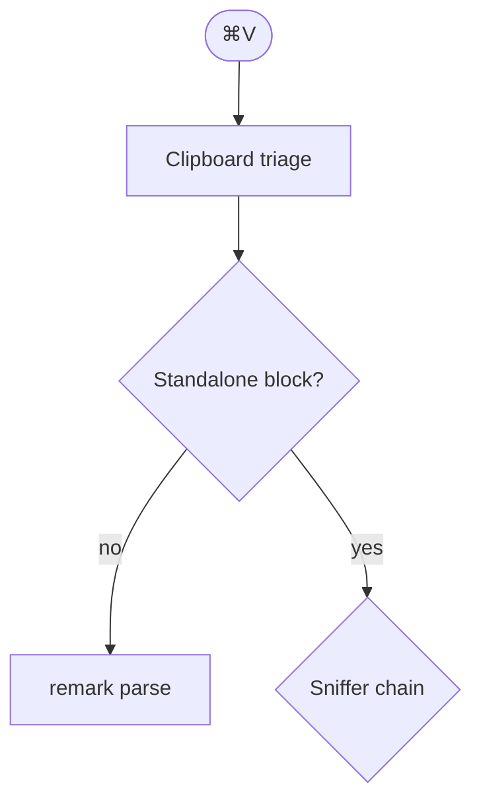

# Mermaid, fenced and bare

An ordinary fenced Mermaid block, which is what SimpleMark writes to disk:

A bare diagram at a block boundary, with no fence. Conversion and
serialization must agree: whatever the paste pipeline does with this on the way
in, an untouched save must still emit these exact bytes.

sequenceDiagram
  participant You
  participant Agent
  You->>Agent: draft the architecture section
  Agent-->>You: run 17, fence 3

Prose between the two bare blocks.

graph LR
  A[Files] --> B[DocumentSession]
  B --> C[Atomic save]

A paragraph that merely begins with the word graph should stay prose, because
mermaid.parse rejects it.

Some valid Mermaid quoted inside a sentence — `flowchart TB` — fails the
standalone-block test and stays text.
