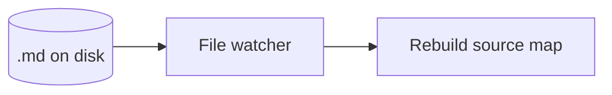

# Notes changed underneath the editor

This fixture exercises the reopen path: the file is edited outside SimpleMark
while a session is open, and the source map has to rebuild against the new
bytes rather than against what the session remembers.

## Stable anchor one

A paragraph whose byte range shifts when anything above it grows or shrinks.
The block itself is untouched, so it must still re-emit verbatim.

- a list that survives the external edit
- second item
- third item

## Stable anchor two

| block | expectation |
|---|---|
| untouched above the edit | byte-identical |
| untouched below the edit | byte-identical, new offsets |
| the externally edited block | reloaded from disk |

## Stable anchor three

The final paragraph exists so that an external insertion in the middle of the
document provably shifts every offset after it.
